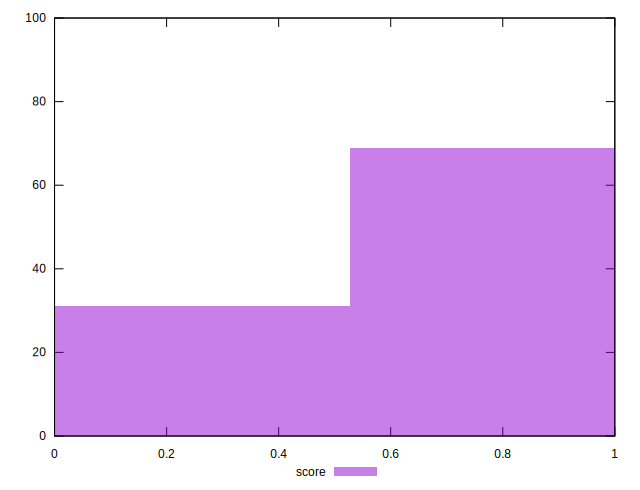

# //third-party-summary/samples/pages+cached+nointeractive

[→ Parent](../..)


## Raw


```yaml
? p90min
? p90max
? p90range
? p90mean
? p90median
? p90stdev
? p90skewness
? p90eccentricity
? p90discretization
? outlandishness

```


## Score


```yaml
p90min: 0
p90max: 1
p90range: 1
p90mean: 0.6555555555555556
p90median: 1
p90stdev: 0.4751867728965135
p90skewness: -0.6547133229629373
p90eccentricity: 1.0000000000000013
p90discretization: 45
outlandishness: 1.1078454467107153

```

