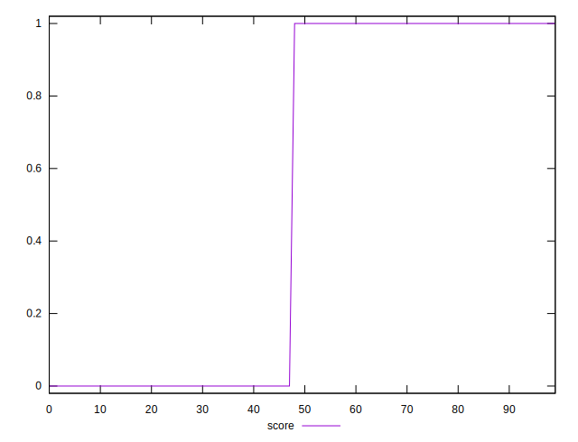

# //third-party-summary/samples/pages+cached

[→ Parent](../..)


## Raw


```yaml
? p90min
? p90max
? p90range
? p90mean
? p90median
? p90stdev
? p90skewness
? p90eccentricity
? p90discretization
? outlandishness

```


## Score


```yaml
p90min: 0
p90max: 1
p90range: 1
p90mean: 0.5714285714285714
p90median: 1
p90stdev: 0.49487165930539384
p90skewness: -0.2886751345948121
p90eccentricity: 0.9999999999999988
p90discretization: 45.5
outlandishness: 0.8281000000000001

```

