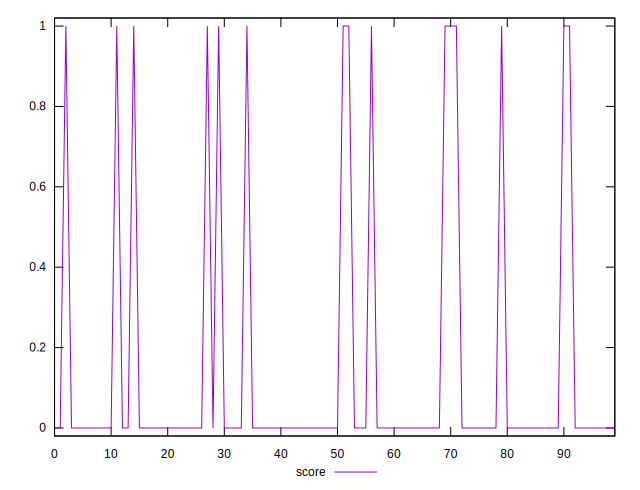
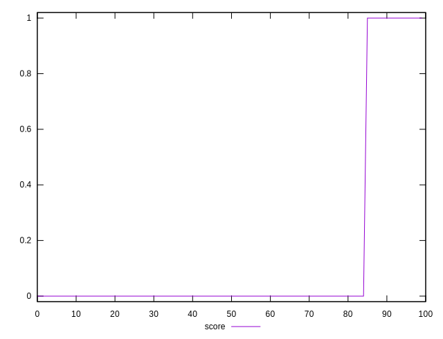
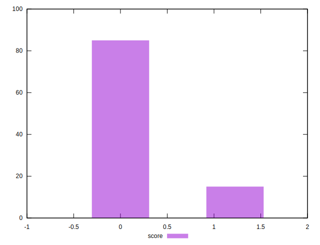

# //third-party-summary/samples/pages

[→ Parent](../..)


## Raw


```yaml
? p90min
? p90max
? p90range
? p90mean
? p90median
? p90stdev
? p90skewness
? p90eccentricity
? p90discretization
? outlandishness

```


## Score


```yaml
p90min: 0
p90max: 1
p90range: 1
p90mean: 0.05555555555555555
p90median: 0
p90stdev: 0.22906142364542514
p90skewness: 3.8805700005813497
p90eccentricity: 1.000000000000004
p90discretization: 45
outlandishness: 7.290000000000001

```

