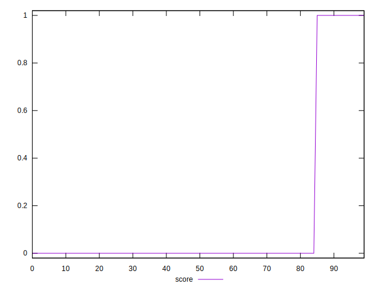
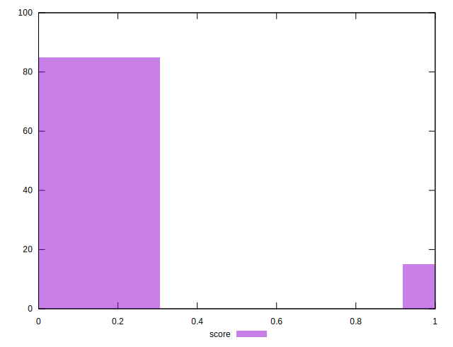

# //third-party-summary/samples/pages

[→ Parent](../..)


## Raw


```yaml
p90min: null
p90max: null
p90range: 0
p90mean: null
p90median: null
p90stdev: null
p90skewness: null
p90eccentricity: null
p90discretization: null
outlandishness: null

```


## Score


```yaml
p90min: 0
p90max: 1
p90range: 1
p90mean: 0.06593406593406594
p90median: 0
p90stdev: 0.24816680858541149
p90skewness: 3.4981787978833734
p90eccentricity: 0.9999999999999992
p90discretization: 45.5
outlandishness: 5.175624999999999

```

