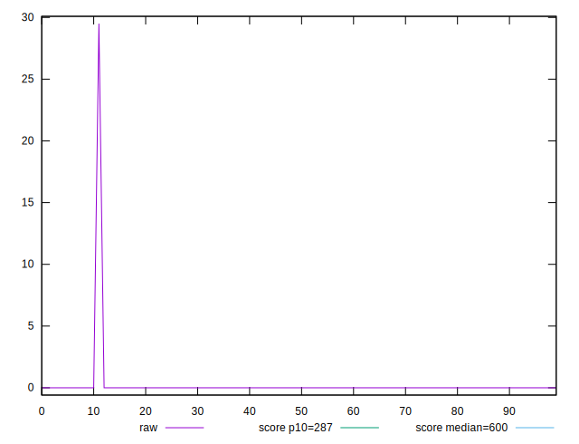
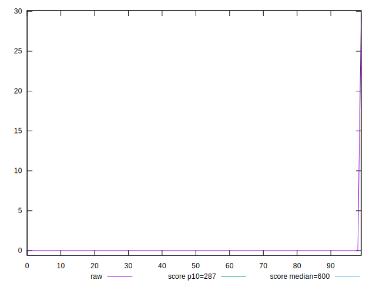
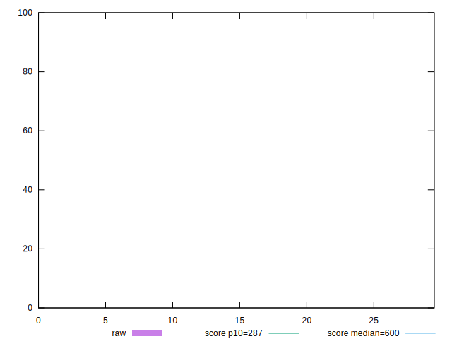

# //total-blocking-time/samples/pages+cached+noexternal+nosvg

[→ Parent](../..)


## Raw


```yaml
p90min: 0
p90max: 0
p90range: 0
p90mean: 0
p90median: 0
p90stdev: 0
p90skewness: .nan
p90eccentricity: .nan
p90discretization: 90
outlandishness: .inf

```


## Score


```yaml
p90min: 0.999999917458638
p90max: 1
p90range: 8.254136196761408e-8
p90mean: 0.9999999990828737
p90median: 1
p90stdev: 8.652151682408064e-9
p90skewness: -9.327981337212352
p90eccentricity: 0.9999999999999952
p90discretization: 45
outlandishness: 1.0000000001834253

```

