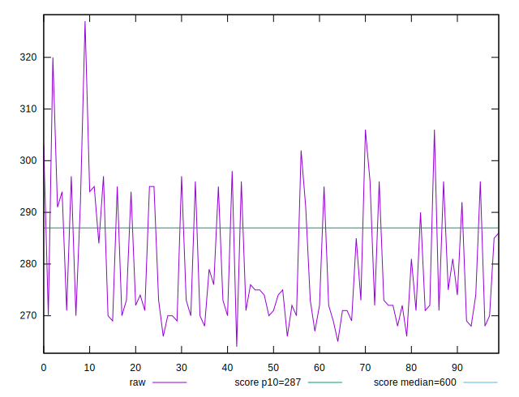
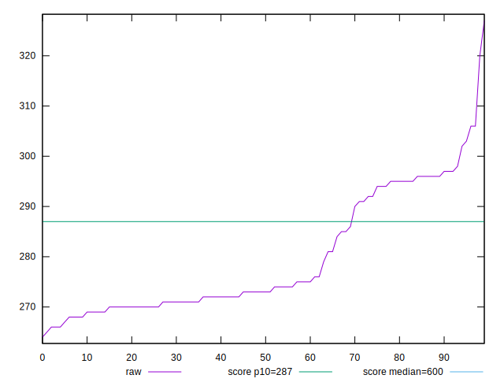
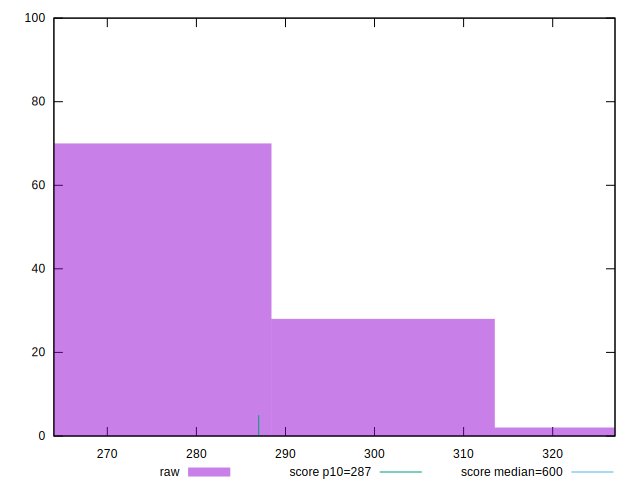
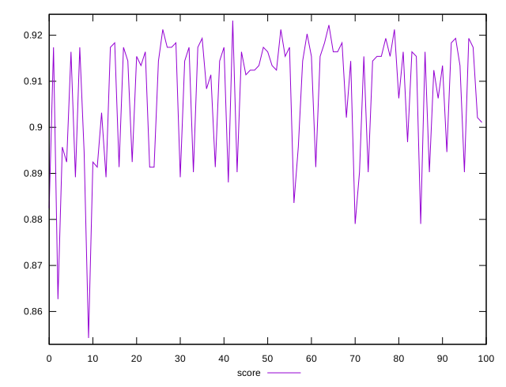
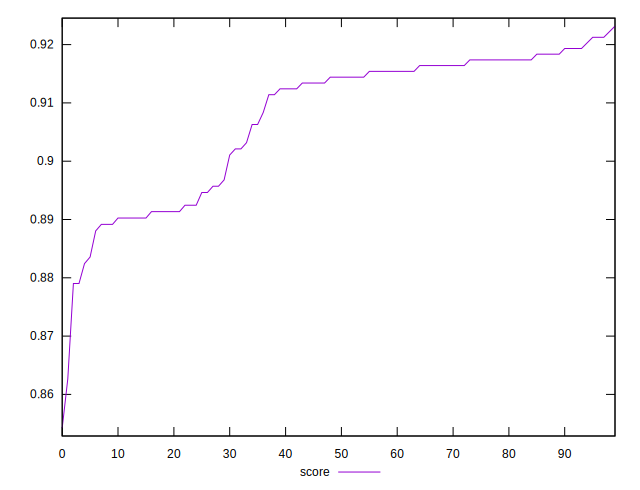
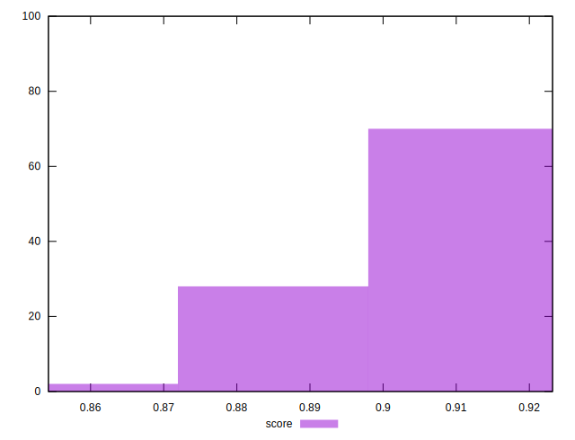

# //total-blocking-time/samples/pages+cached+nointeractive

[→ Parent](../..)


## Raw


```yaml
p90min: 264
p90max: 296
p90range: 32
p90mean: 277.0666666666662
p90median: 272.49999999999864
p90stdev: 10.007552703389166
p90skewness: 0.9262691451246241
p90eccentricity: 1.0000000000000004
p90discretization: 1.6363636363636365
outlandishness: 1.0204840111088618

```


## Score


```yaml
p90min: 0.8542425396099678
p90max: 0.9183580026018741
p90range: 0.06411546299190629
p90mean: 0.905527502253632
p90median: 0.9134178324564849
p90stdev: 0.013845177793515984
p90skewness: -1.1839414923512825
p90eccentricity: 0.9999999999999996
p90discretization: 1.6666666666666667
outlandishness: 1.0033492268047157

```

