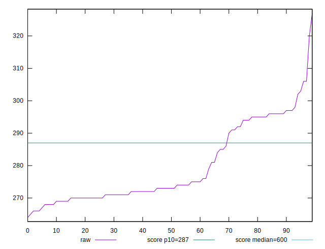

# //total-blocking-time/samples/pages+cached+nointeractive

[→ Parent](../..)


## Raw


```yaml
p90min: 264
p90max: 297
p90range: 33
p90mean: 277.2857142857138
p90median: 272.99999999999636
p90stdev: 10.167050545634623
p90skewness: 0.8918203655071418
p90eccentricity: 0.9999999999999989
p90discretization: 1.625
outlandishness: 1.0188723427935

```


## Score


```yaml
p90min: 0.8891520440062339
p90max: 0.9231692315882869
p90range: 0.034017187582052966
p90mean: 0.9098563906095339
p90median: 0.9144159850101924
p90stdev: 0.010551456348315693
p90skewness: -0.9201537455577801
p90eccentricity: 1.0000000000000007
p90discretization: 1.625
outlandishness: 0.9938245272814059

```


## P Score


```yaml
p90min: 0.8891520440062339
p90max: 0.9231692315882869
p90range: 0.034017187582052966
p90mean: 0.9098563906095339
p90median: 0.9144159850101924
p90stdev: 0.010551456348315693
p90skewness: -0.9201537455577801
p90eccentricity: 1.0000000000000007
p90discretization: 1.625
outlandishness: 0.9938245272814059

```


## Score Difference


```yaml
p90min: -0.004242539609967788
p90max: 0.004590888503434143
p90range: 0.008833428113401931
p90mean: 0.0007242712879700267
p90median: 0.0008479559937660808
p90stdev: 0.0026528853940520104
p90skewness: -0.09662909543979284
p90eccentricity: 0.9999999999999999
p90discretization: 1.625
outlandishness: 0.12626089573986568

```


## P Score Difference


```yaml
p90min: 0
p90max: 0
p90range: 0
p90mean: 0
p90median: 0
p90stdev: 0
p90skewness: .nan
p90eccentricity: .nan
p90discretization: 91
outlandishness: .nan

```

