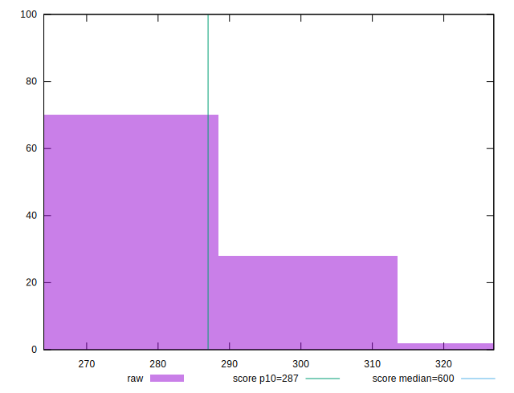

# //total-blocking-time/samples/pages+cached+nointeractive

[→ Parent](../..)


## Raw


```yaml
p90min: 264
p90max: 297
p90range: 33
p90mean: 277.2857142857138
p90median: 272.99999999999636
p90stdev: 10.167050545634623
p90skewness: 0.8918203655071418
p90eccentricity: 0.9999999999999992
p90discretization: 1.625
outlandishness: 1.0188723427935

```


## Score


```yaml
p90min: 0.8891520440062339
p90max: 0.9231692315882869
p90range: 0.034017187582052966
p90mean: 0.9098563906095339
p90median: 0.9144159850101924
p90stdev: 0.0105514563483157
p90skewness: -0.920153745557841
p90eccentricity: 0.9999999999999993
p90discretization: 1.625
outlandishness: 0.9938245272814059

```

