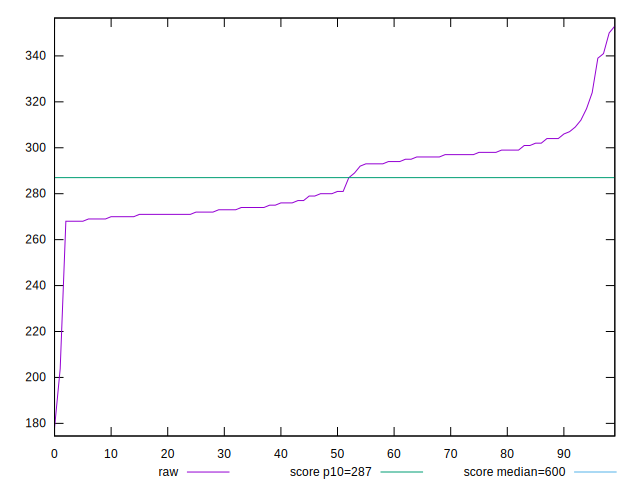
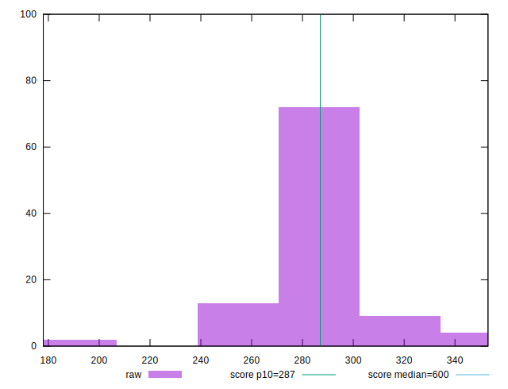
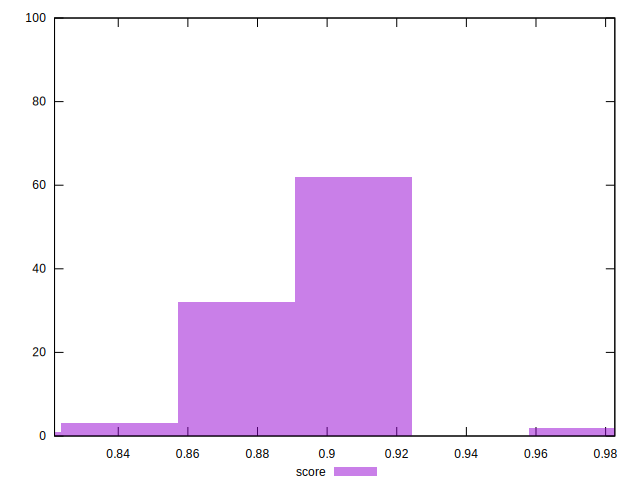

# //total-blocking-time/samples/pages+cached

[→ Parent](../..)


## Raw


```yaml
p90min: 178
p90max: 304
p90range: 126
p90mean: 281.2415166666661
p90median: 277.99999999999864
p90stdev: 18.41599507228698
p90skewness: -2.560960476932934
p90eccentricity: 0.9999999999999999
p90discretization: 1.3846153846153846
outlandishness: 1.0319380046739774

```


## Score


```yaml
p90min: 0.821695891391382
p90max: 0.917380153295033
p90range: 0.09568426190365098
p90mean: 0.8968219898736706
p90median: 0.8940869971087324
p90stdev: 0.020225396268435024
p90skewness: -1.5129631512252517
p90eccentricity: 1.0000000000000013
p90discretization: 1.3432835820895523
outlandishness: 1.0074830275141387

```

