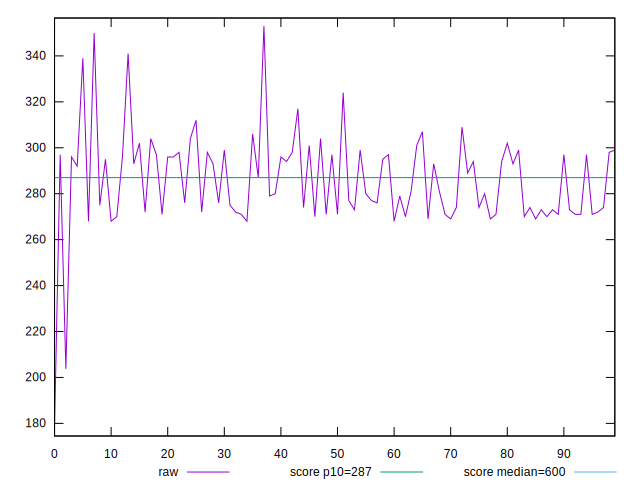

# //total-blocking-time/samples/pages+cached

[→ Parent](../..)


## Raw


```yaml
p90min: 267.9999999999982
p90max: 308.9999999999982
p90range: 41
p90mean: 284.0879120879116
p90median: 280
p90stdev: 12.91021262977945
p90skewness: 0.24760238444137392
p90eccentricity: 1.0000000000000007
p90discretization: 1.378787878787879
outlandishness: 1.011362764042942

```


## Score


```yaml
p90min: 0.8755853285196531
p90max: 0.91933069384378
p90range: 0.04374536532412687
p90mean: 0.9026912022074481
p90median: 0.9073252563220249
p90stdev: 0.013626167865116013
p90skewness: -0.2790437412758378
p90eccentricity: 1.0000000000000002
p90discretization: 1.378787878787879
outlandishness: 0.9944245009959857

```

