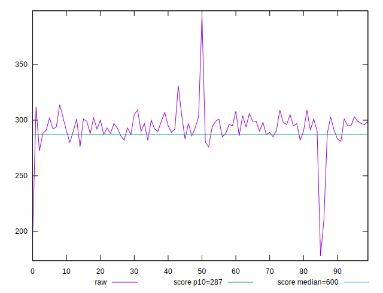
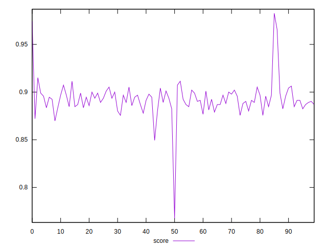
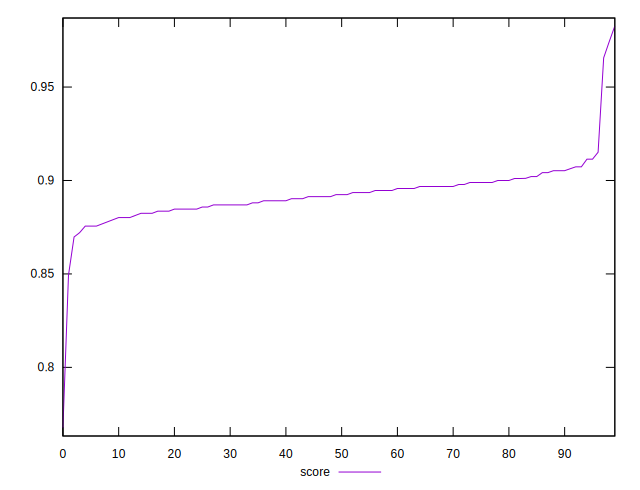

# //total-blocking-time/samples/pages

[→ Parent](../..)


## Raw


```yaml
p90min: 276
p90max: 309
p90range: 33
p90mean: 294.2408131868132
p90median: 294
p90stdev: 7.502458363268266
p90skewness: -0.057311097264399924
p90eccentricity: 1.0000000000000009
p90discretization: 1.8571428571428572
outlandishness: 0.9888242654495257

```


## Score


```yaml
p90min: 0.8755853285196511
p90max: 0.9114065832202423
p90range: 0.035821254700591165
p90mean: 0.8920677980016163
p90median: 0.8924519953997028
p90stdev: 0.008200701955726314
p90skewness: -0.004143035903908001
p90eccentricity: 0.9999999999999993
p90discretization: 1.8571428571428572
outlandishness: 1.0017799285958289

```


## P Score


```yaml
p90min: 0.8755853285196511
p90max: 0.9114065832202423
p90range: 0.035821254700591165
p90mean: 0.8920677980016163
p90median: 0.8924519953997028
p90stdev: 0.008200701955726314
p90skewness: -0.004143035903908001
p90eccentricity: 0.9999999999999993
p90discretization: 1.8571428571428572
outlandishness: 1.0017799285958289

```


## Score Difference


```yaml
p90min: -0.004336765025860778
p90max: 0.004866471339424749
p90range: 0.009203236365285528
p90mean: 0.000723684227493866
p90median: 0.0008479559937660808
p90stdev: 0.0026968305276730913
p90skewness: -0.17442206218318143
p90eccentricity: 0.9999999999999993
p90discretization: 1.6545454545454545
outlandishness: 0.10874562836530112

```


## P Score Difference


```yaml
p90min: 0
p90max: 0
p90range: 0
p90mean: 0
p90median: 0
p90stdev: 0
p90skewness: .nan
p90eccentricity: .nan
p90discretization: 91
outlandishness: .nan

```

