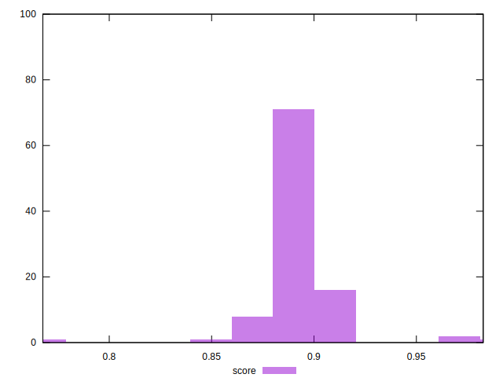

# //total-blocking-time/samples/pages

[→ Parent](../..)


## Raw


```yaml
p90min: 178
p90max: 305.0000000000018
p90range: 127.00000000000182
p90mean: 289.5577944444443
p90median: 292.9999999999991
p90stdev: 19.175260436431333
p90skewness: -4.225087433233104
p90eccentricity: 0.9999999999999997
p90discretization: 1.8
outlandishness: 1.0210674215753173

```


## Score


```yaml
p90min: 0.7675770589246068
p90max: 0.9052557261448053
p90range: 0.1376786672201985
p90mean: 0.888881926742803
p90median: 0.8913562573218646
p90stdev: 0.01570861624941423
p90skewness: -5.248048067039956
p90eccentricity: 1
p90discretization: 1.836734693877551
outlandishness: 1.0089738229515317

```

