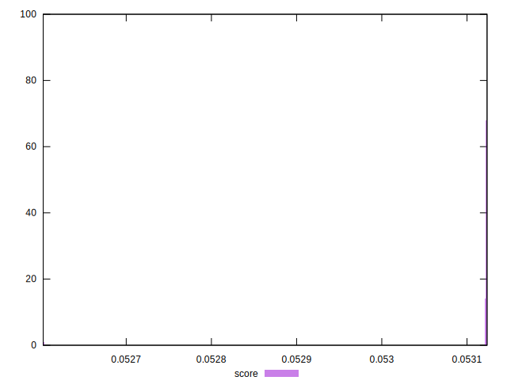

# //total-byte-weight/samples/pages+cached+noadtech

[→ Parent](../..)


## Raw


```yaml
p90min: 6827167
p90max: 6827204
p90range: 37
p90mean: 6827188.6
p90median: 6827190
p90stdev: 8.815138493901657
p90skewness: -0.399742073777779
p90eccentricity: 0.9999999999999992
p90discretization: 2.8125
outlandishness: 1.0000310935675811

```


## Score


```yaml
p90min: 0.05260254134591913
p90max: 0.053123106865500314
p90range: 0.0005205655195811842
p90mean: 0.0531165036324918
p90median: 0.05312230495515885
p90stdev: 0.00005448176076620701
p90skewness: -9.32700068671174
p90eccentricity: 0.999999999999999
p90discretization: 2.5
outlandishness: 1.0000254672626967

```

