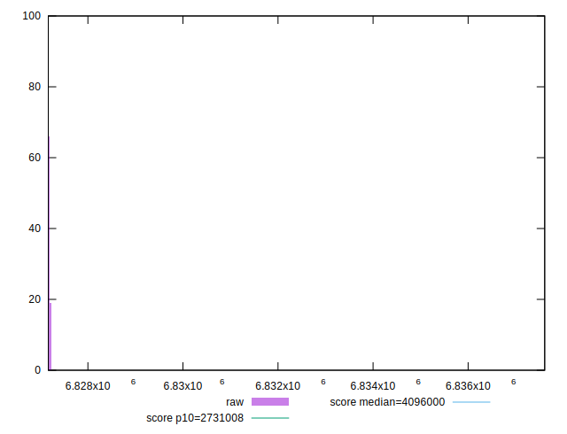

# //total-byte-weight/samples/pages+cached+noadtech

[→ Parent](../..)


## Raw


```yaml
p90min: 6827176
p90max: 6827220
p90range: 44
p90mean: 6827192.164835165
p90median: 6827192
p90stdev: 9.272745999941042
p90skewness: 0.39194234874159084
p90eccentricity: 1.000000000000002
p90discretization: 2.6
outlandishness: 1.0000300492304681

```


## Score


```yaml
p90min: 0.05312090163967803
p90max: 0.053123106865500314
p90range: 0.0000022052258222826637
p90mean: 0.05312229669570708
p90median: 0.05312230495515885
p90stdev: 4.6474028222150016e-7
p90skewness: -0.39191912591615613
p90eccentricity: 0.9999999999999993
p90discretization: 2.6
outlandishness: 0.9998073707107747

```


## P Score


```yaml
p90min: 0
p90max: 0
p90range: 0
p90mean: 0
p90median: 0
p90stdev: 0
p90skewness: .nan
p90eccentricity: .nan
p90discretization: 91
outlandishness: .nan

```


## Score Difference


```yaml
p90min: -0.053123106865500314
p90max: -0.05312090163967803
p90range: 0.0000022052258222826637
p90mean: -0.05312229669570708
p90median: -0.05312230495515885
p90stdev: 4.6474028222150016e-7
p90skewness: 0.39191912591615613
p90eccentricity: 0.9999999999999993
p90discretization: 2.6
outlandishness: 0.9998073707107747

```


## P Score Difference


```yaml
p90min: -0.053123106865500314
p90max: -0.05312090163967803
p90range: 0.0000022052258222826637
p90mean: -0.05312229669570708
p90median: -0.05312230495515885
p90stdev: 4.6474028222150016e-7
p90skewness: 0.39191912591615613
p90eccentricity: 0.9999999999999993
p90discretization: 2.6
outlandishness: 0.9998073707107747

```

