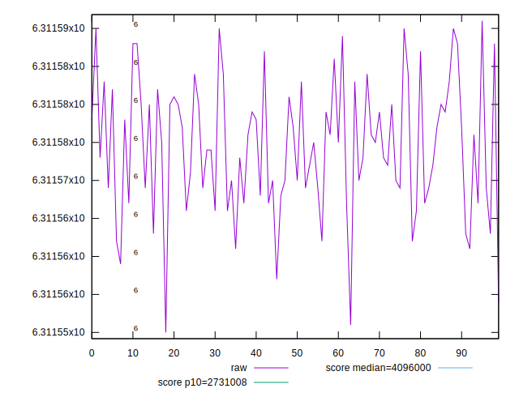
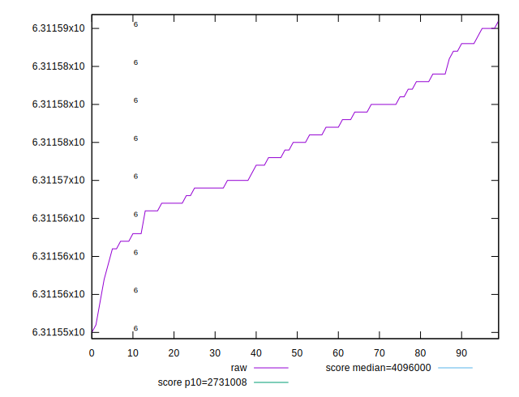
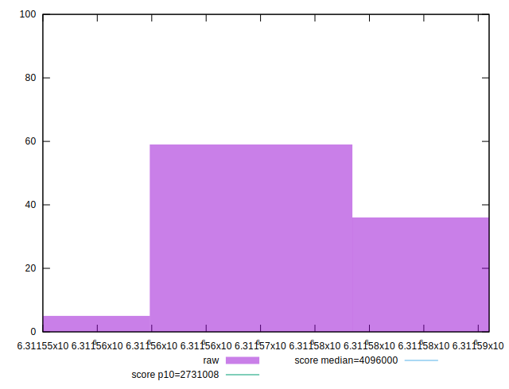
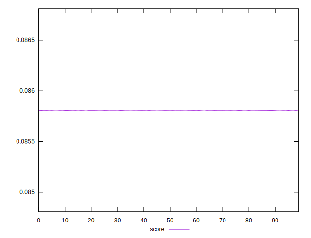
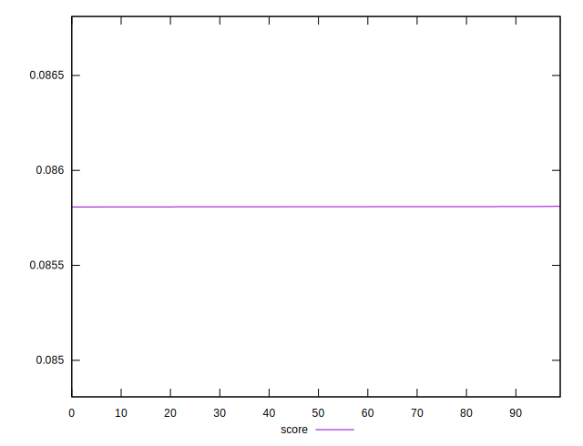
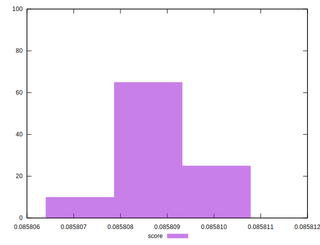

# //total-byte-weight/samples/pages+cached+noexternal+nocss

[→ Parent](../..)


## Raw


```yaml
p90min: 6311550
p90max: 6311587
p90range: 37
p90mean: 6311572.722222222
p90median: 6311573
p90stdev: 8.052643151685983
p90skewness: -0.47178154992419824
p90eccentricity: 0.999999999999998
p90discretization: 3.103448275862069
outlandishness: 1.000000522144976

```


## Score


```yaml
p90min: 0.0858075516366752
p90max: 0.08580974975516603
p90range: 0.0000021981184908370643
p90mean: 0.08580871349470844
p90median: 0.08580872919369831
p90stdev: 5.898217204156258e-7
p90skewness: -0.2170452958318553
p90eccentricity: 1.0000000000000002
p90discretization: 3.4615384615384617
outlandishness: 1.0000033484699213

```

