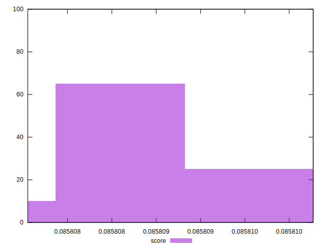

# //total-byte-weight/samples/pages+cached+noexternal+nocss

[→ Parent](../..)


## Raw


```yaml
p90min: 6311559
p90max: 6311589
p90range: 30
p90mean: 6311574.439560439
p90median: 6311575
p90stdev: 7.545042461169622
p90skewness: 0.04310830706437505
p90eccentricity: 1
p90discretization: 3.3703703703703702
outlandishness: 0.9999999779578171

```


## Score


```yaml
p90min: 0.08580770864341775
p90max: 0.08581006377632983
p90range: 0.0000023551329120796716
p90mean: 0.08580885169687535
p90median: 0.0858088076980294
p90stdev: 5.923189600074342e-7
p90skewness: -0.04309783483703122
p90eccentricity: 0.9999999999999997
p90discretization: 3.3703703703703702
outlandishness: 1.0000001272983137

```

