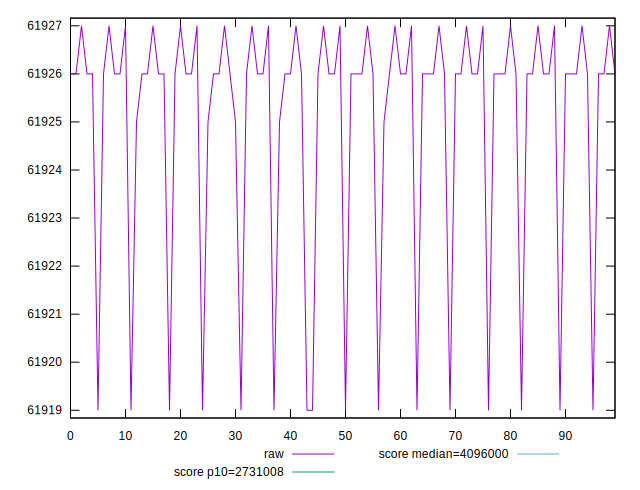
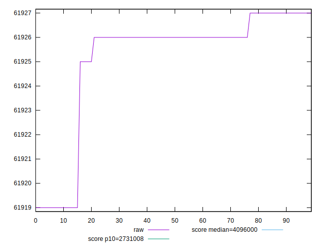
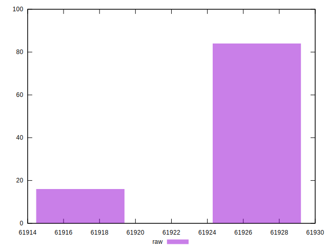

# //total-byte-weight/samples/pages+cached+noexternal+nofonts+nosvg+noimg+nocss

[→ Parent](../..)


## Raw


```yaml
p90min: 61919
p90max: 61927
p90range: 8
p90mean: 61924.84444444445
p90median: 61926
p90stdev: 2.7524175680909684
p90skewness: -1.5865838155266743
p90eccentricity: 1.0000000000000013
p90discretization: 22.5
outlandishness: 1.0000069618561869

```


## Score


```yaml
p90min: 1
p90max: 1
p90range: 0
p90mean: 1
p90median: 1
p90stdev: 0
p90skewness: .nan
p90eccentricity: .nan
p90discretization: 90
outlandishness: 1

```

