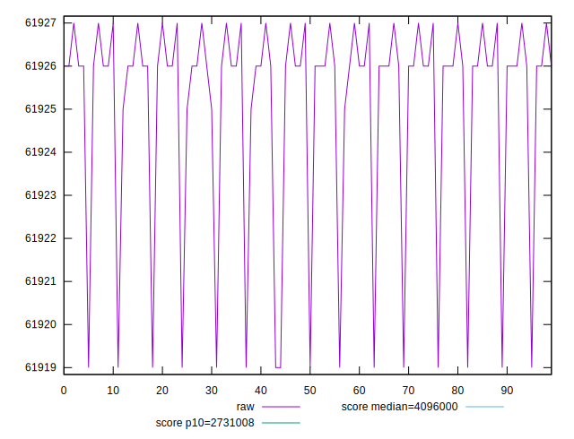
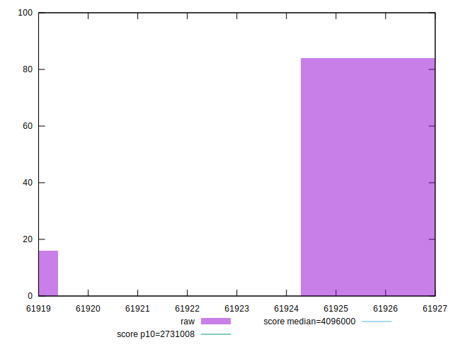

# //total-byte-weight/samples/pages+cached+noexternal+nofonts+nosvg+noimg+nocss

[→ Parent](../..)


## Raw


```yaml
p90min: 61919
p90max: 61927
p90range: 8
p90mean: 61925.65934065934
p90median: 61926
p90stdev: 1.9901945358543767
p90skewness: -2.8034510825326158
p90eccentricity: 1.0000000000000024
p90discretization: 22.75
outlandishness: 0.9999806433144064

```


## Score


```yaml
p90min: 1
p90max: 1
p90range: 0
p90mean: 1
p90median: 1
p90stdev: 0
p90skewness: .nan
p90eccentricity: .nan
p90discretization: 91
outlandishness: 1

```

