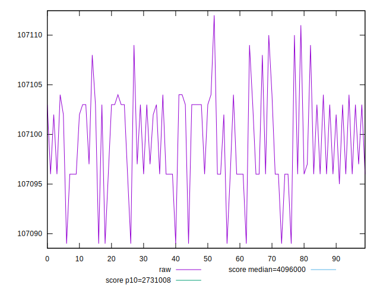
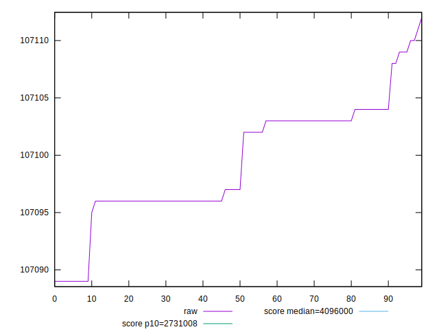

# //total-byte-weight/samples/pages+cached+noexternal+nofonts+nosvg+noimg

[→ Parent](../..)


## Raw


```yaml
p90min: 107089
p90max: 107109
p90range: 20
p90mean: 107099.47252747252
p90median: 107097
p90stdev: 4.66537552365485
p90skewness: -0.15803915845422165
p90eccentricity: 1.0000000000000002
p90discretization: 10.11111111111111
outlandishness: 0.9999986456058793

```


## Score


```yaml
p90min: 1
p90max: 1
p90range: 0
p90mean: 1
p90median: 1
p90stdev: 0
p90skewness: .nan
p90eccentricity: .nan
p90discretization: 91
outlandishness: 1

```

