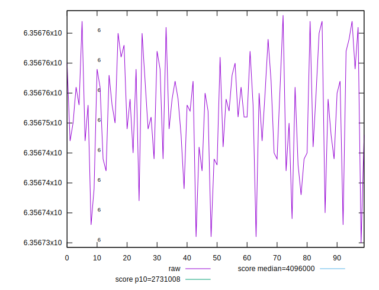
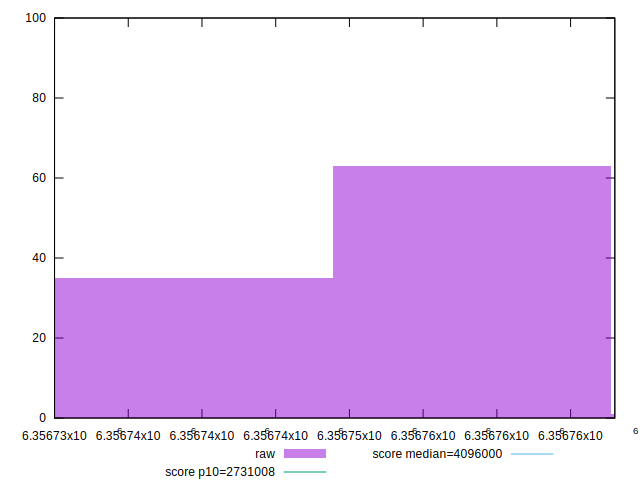

# //total-byte-weight/samples/pages+cached+noexternal+nofonts

[→ Parent](../..)


## Raw


```yaml
p90min: 6356737
p90max: 6356767
p90range: 30
p90mean: 6356753.065934066
p90median: 6356753
p90stdev: 7.651477193875705
p90skewness: 0.017715663080516024
p90eccentricity: 0.9999999999999991
p90discretization: 3.1379310344827585
outlandishness: 0.9999995230477354

```


## Score


```yaml
p90min: 0.08232792174608616
p90max: 0.08233018857881325
p90range: 0.0000022668327270825017
p90mean: 0.0823289746140096
p90median: 0.08232897959417856
p90stdev: 5.781534076705337e-7
p90skewness: -0.01770411168042447
p90eccentricity: 0.9999999999999997
p90discretization: 3.1379310344827585
outlandishness: 1.0000027826565074

```

