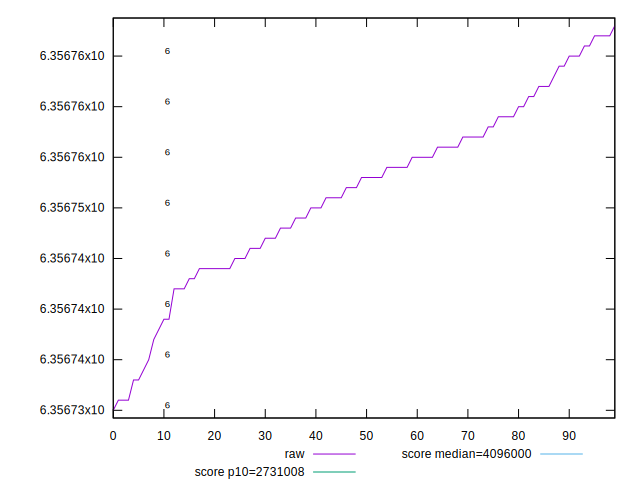
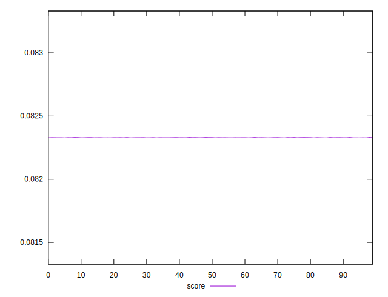

# //total-byte-weight/samples/pages+cached+noexternal+nofonts

[→ Parent](../..)


## Raw


```yaml
p90min: 6356730
p90max: 6356764
p90range: 34
p90mean: 6356749.911111111
p90median: 6356751
p90stdev: 8.42040437725786
p90skewness: -0.5544868425186565
p90eccentricity: 0.9999999999999973
p90discretization: 2.903225806451613
outlandishness: 1.000000515637432

```


## Score


```yaml
p90min: 0.08232784618598887
p90max: 0.08233003745483636
p90range: 0.000002191268847484551
p90mean: 0.08232893593850278
p90median: 0.08232890403318383
p90stdev: 5.655561750055852e-7
p90skewness: -0.1024131707620656
p90eccentricity: 0.9999999999999986
p90discretization: 3.2142857142857144
outlandishness: 1.0000037221955187

```

