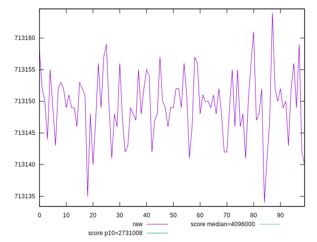
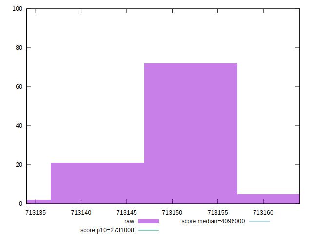
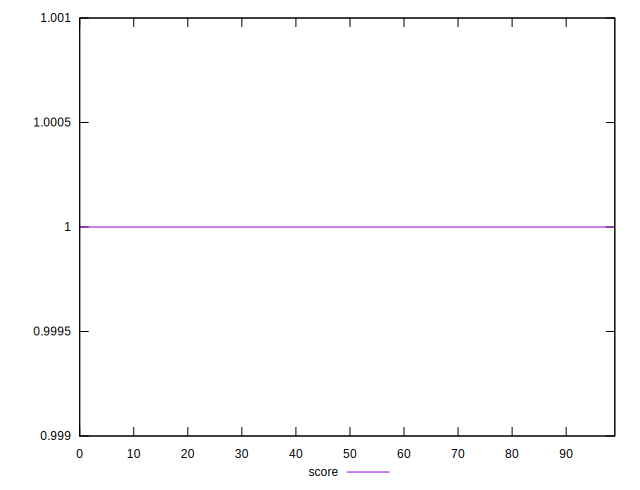

# //total-byte-weight/samples/pages+cached+noexternal+noimg

[→ Parent](../..)


## Raw


```yaml
p90min: 713134
p90max: 713156
p90range: 22
p90mean: 713148.411111111
p90median: 713149
p90stdev: 4.523750765421804
p90skewness: -0.7183078651383361
p90eccentricity: 0.9999999999999977
p90discretization: 5
outlandishness: 1.0000028013512279

```


## Score


```yaml
p90min: 0.9999999836500553
p90max: 0.9999999836591352
p90range: 9.079959006896843e-12
p90mean: 0.9999999836556329
p90median: 0.999999983655834
p90stdev: 1.781229325004522e-12
p90skewness: -0.4573082659754503
p90eccentricity: 0.9999996604590023
p90discretization: 4.7368421052631575
outlandishness: 1.0000000000008895

```

