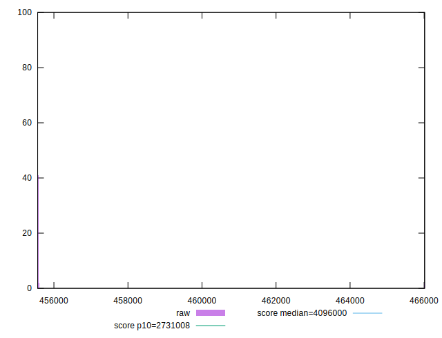
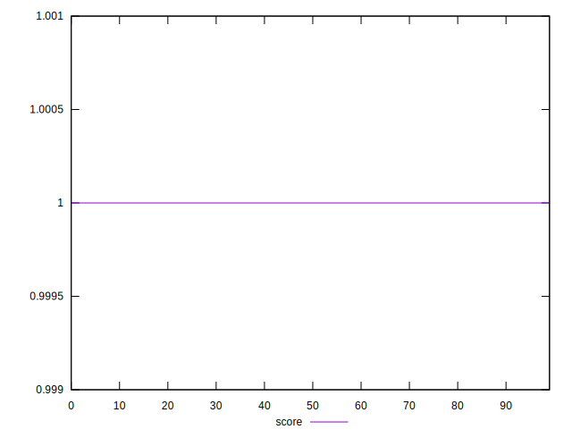

# //total-byte-weight/samples/pages+cached+noexternal+nojs

[→ Parent](../..)


## Raw


```yaml
p90min: 455561
p90max: 455591
p90range: 30
p90mean: 455580.4
p90median: 455582
p90stdev: 5.701461800860086
p90skewness: -0.524123317397255
p90eccentricity: 0.9999999999999984
p90discretization: 5
outlandishness: 1.0009209275702942

```


## Score


```yaml
p90min: 0.9999999999968165
p90max: 0.9999999999980778
p90range: 1.2612133559741778e-12
p90mean: 0.9999999999980493
p90median: 0.9999999999980771
p90stdev: 1.8574755557316867e-13
p90skewness: -6.491714497509425
p90eccentricity: 0.9999919737462284
p90discretization: 6
outlandishness: 1.000000000000007

```

