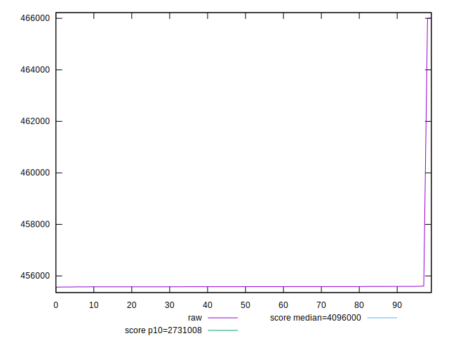

# //total-byte-weight/samples/pages+cached+noexternal+nojs

[→ Parent](../..)


## Raw


```yaml
p90min: 455574
p90max: 455608
p90range: 34
p90mean: 455582.5494505495
p90median: 455583
p90stdev: 5.976627988731314
p90skewness: 1.0345752163173054
p90eccentricity: 0.9999999999999999
p90discretization: 5.352941176470588
outlandishness: 1.0009114828496173

```


## Score


```yaml
p90min: 0.9999999999980747
p90max: 0.999999999998078
p90range: 3.3306690738754696e-15
p90mean: 0.9999999999980776
p90median: 0.9999999999980771
p90stdev: 7.757605495710442e-16
p90skewness: -1.8322668288044188
p90eccentricity: 1.0000000000000002
p90discretization: 6.5
outlandishness: 0.9999999999999503

```

