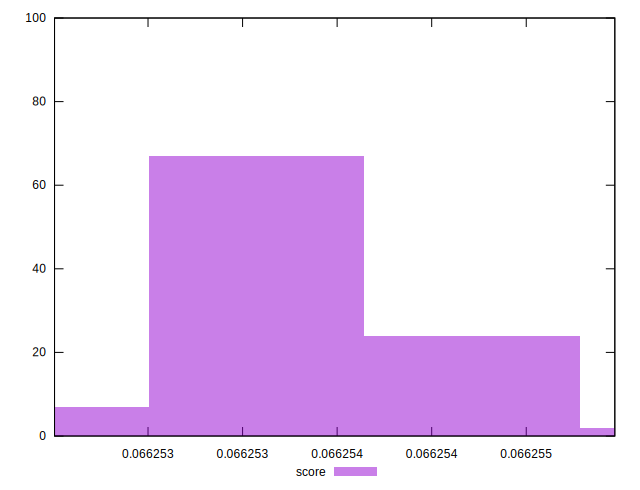

# //total-byte-weight/samples/pages+cached+noexternal+nosvg

[→ Parent](../..)


## Raw


```yaml
p90min: 6591608
p90max: 6591637
p90range: 29
p90mean: 6591624.516483516
p90median: 6591624
p90stdev: 7.483847276095774
p90skewness: -0.19276510449581935
p90eccentricity: 0.9999999999999997
p90discretization: 3.3703703703703702
outlandishness: 0.9999996582076488

```


## Score


```yaml
p90min: 0.06625293768939561
p90max: 0.06625472769959811
p90range: 0.0000017900102025070197
p90mean: 0.06625370822403348
p90median: 0.06625374010215668
p90stdev: 4.619361319811744e-7
p90skewness: 0.19277575317518092
p90eccentricity: 0.9999999999999991
p90discretization: 3.3703703703703702
outlandishness: 1.0000020989751004

```

