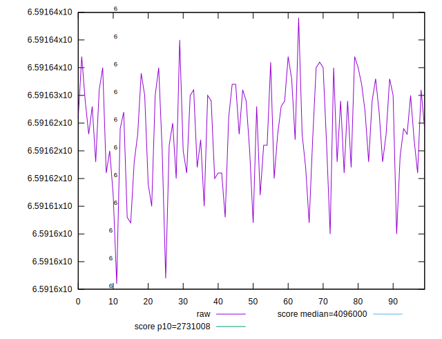
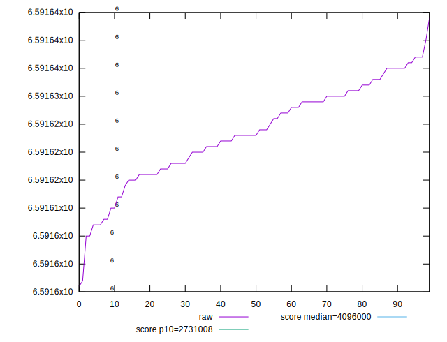
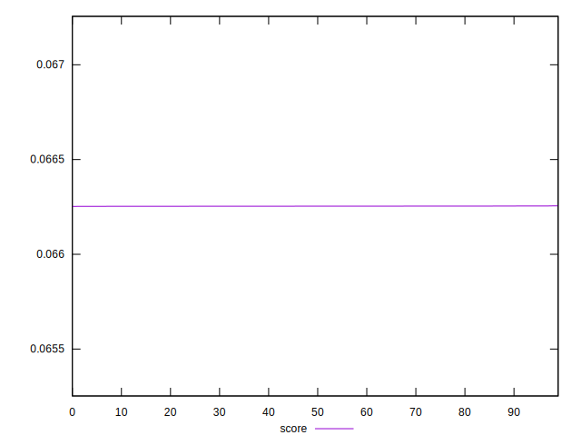

# //total-byte-weight/samples/pages+cached+noexternal+nosvg

[→ Parent](../..)


## Raw


```yaml
p90min: 6591596
p90max: 6591635
p90range: 39
p90mean: 6591621.855555556
p90median: 6591623
p90stdev: 8.596589906741585
p90skewness: -0.6978085003897379
p90eccentricity: 1.0000000000000007
p90discretization: 3.103448275862069
outlandishness: 1.0000004655742263

```


## Score


```yaml
p90min: 0.0662525056247587
p90max: 0.06625460424916335
p90range: 0.000002098624404645033
p90mean: 0.06625365163202171
p90median: 0.06625364751561069
p90stdev: 4.5470248198638216e-7
p90skewness: -0.06453484730426366
p90eccentricity: 0.9999999999999999
p90discretization: 3.2142857142857144
outlandishness: 1.0000038073233448

```

