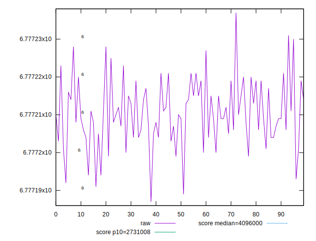
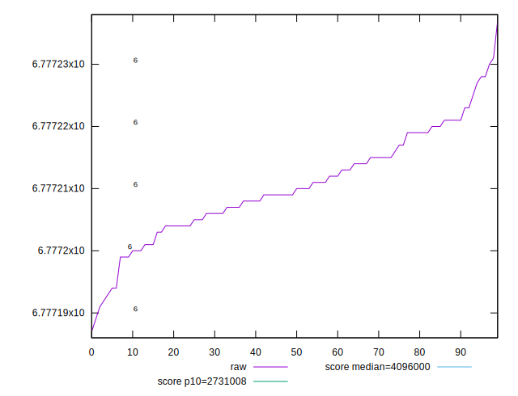
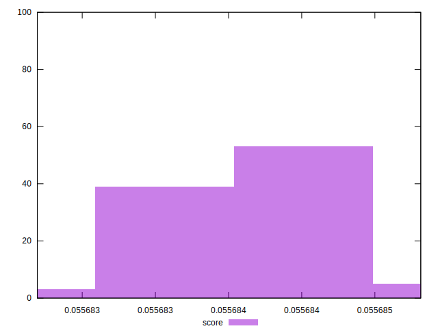

# //total-byte-weight/samples/pages+cached+noexternal

[→ Parent](../..)


## Raw


```yaml
p90min: 6777187
p90max: 6777221
p90range: 34
p90mean: 6777208.577777778
p90median: 6777209
p90stdev: 7.753103719411375
p90skewness: -0.5101240363436631
p90eccentricity: 1.0000000000000024
p90discretization: 3.3333333333333335
outlandishness: 1.0000005525054925

```


## Score


```yaml
p90min: 0.05568269320705577
p90max: 0.055684632183910954
p90range: 0.000001938976855186958
p90mean: 0.055683987017174114
p90median: 0.055684055724660786
p90stdev: 4.0904543123443397e-7
p90skewness: -0.7002580081413089
p90eccentricity: 0.9999999999999996
p90discretization: 3.3333333333333335
outlandishness: 1.0000035030697272

```

