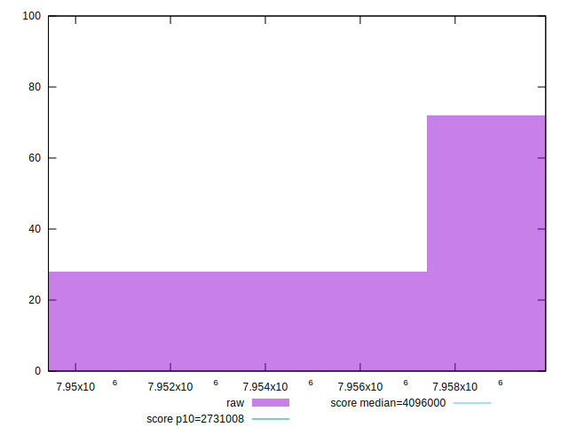
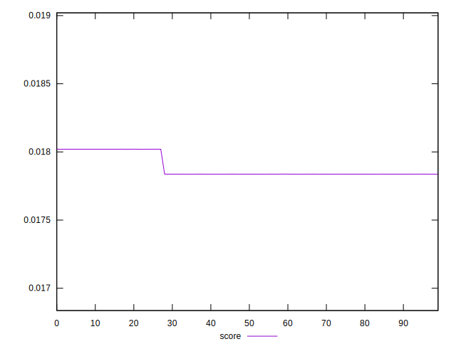
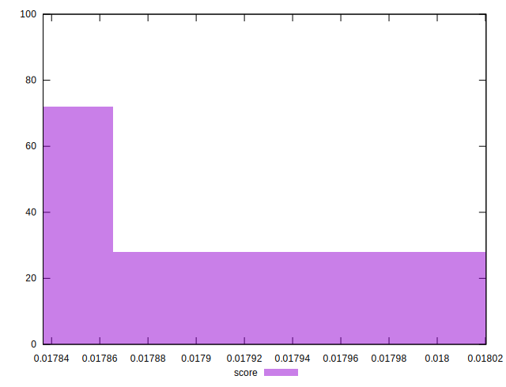

# //total-byte-weight/samples/pages+cached+nointeractive

[→ Parent](../..)


## Raw


```yaml
p90min: 7949445
p90max: 7959908
p90range: 10463
p90mean: 7957701.879120879
p90median: 7959873
p90stdev: 4236.149017901962
p90skewness: -1.4329362646263692
p90eccentricity: 0.9999999999999991
p90discretization: 1.6545454545454545
outlandishness: 0.9998130303557206

```


## Score


```yaml
p90min: 0.01783648779851399
p90max: 0.018019955082207995
p90range: 0.00018346728369400545
p90mean: 0.01787516955336742
p90median: 0.017837098452315014
p90stdev: 0.00007428098589604698
p90skewness: 1.4329365252349977
p90eccentricity: 1.0000000000000007
p90discretization: 1.6545454545454545
outlandishness: 1.0014601552612135

```


## P Score


```yaml
p90min: 0
p90max: 0
p90range: 0
p90mean: 0
p90median: 0
p90stdev: 0
p90skewness: .nan
p90eccentricity: .nan
p90discretization: 91
outlandishness: .nan

```


## Score Difference


```yaml
p90min: -0.018019955082207995
p90max: -0.01783648779851399
p90range: 0.00018346728369400545
p90mean: -0.01787516955336742
p90median: -0.017837098452315014
p90stdev: 0.00007428098589604698
p90skewness: -1.4329365252349977
p90eccentricity: 1.0000000000000007
p90discretization: 1.6545454545454545
outlandishness: 1.0014601552612135

```


## P Score Difference


```yaml
p90min: -0.018019955082207995
p90max: -0.01783648779851399
p90range: 0.00018346728369400545
p90mean: -0.01787516955336742
p90median: -0.017837098452315014
p90stdev: 0.00007428098589604698
p90skewness: -1.4329365252349977
p90eccentricity: 1.0000000000000007
p90discretization: 1.6545454545454545
outlandishness: 1.0014601552612135

```

