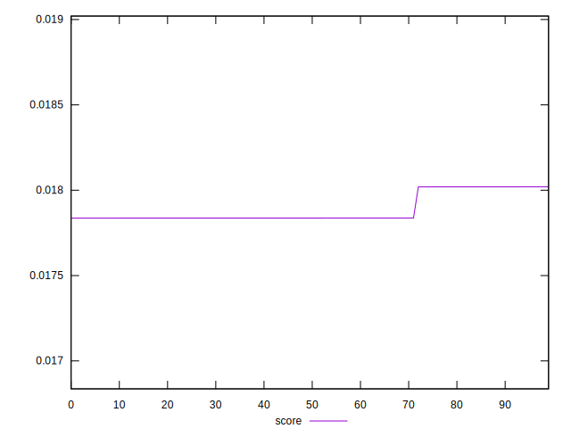

# //total-byte-weight/samples/pages+cached+nointeractive

[→ Parent](../..)


## Raw


```yaml
p90min: 7949427
p90max: 7959890
p90range: 10463
p90mean: 7956631.288888888
p90median: 7959868.5
p90stdev: 4826.54368914339
p90skewness: -0.8160242674009395
p90eccentricity: 0.9999999999999993
p90discretization: 1.6666666666666667
outlandishness: 1.0000821045499257

```


## Score


```yaml
p90min: 0.01783648779851399
p90max: 0.018019937459163693
p90range: 0.0001834496606497038
p90mean: 0.017873560825269183
p90median: 0.017837089728546918
p90stdev: 0.00007309899929909106
p90skewness: 1.4999791736397696
p90eccentricity: 0.9999999999999999
p90discretization: 1.6666666666666667
outlandishness: 1.0016404382624693

```

