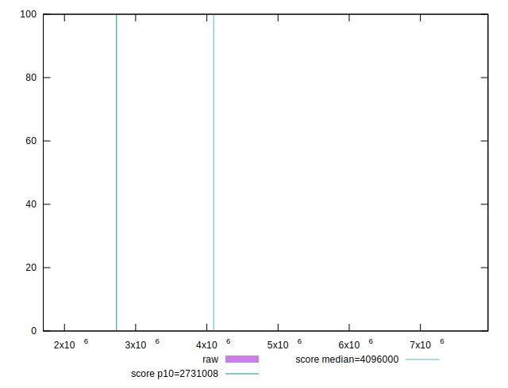
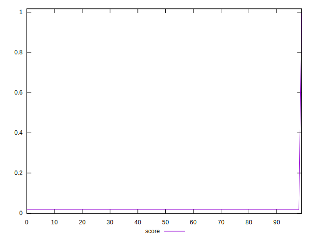

# //total-byte-weight/samples/pages+cached

[→ Parent](../..)


## Raw


```yaml
p90min: 1702593
p90max: 7949462
p90range: 6246869
p90mean: 7880020.788888888
p90median: 7949447.5
p90stdev: 654806.0540931269
p90skewness: -9.32798055387146
p90eccentricity: 0.9999999999999997
p90discretization: 2.25
outlandishness: 1.0017633865434838

```


## Score


```yaml
p90min: 0.018019479265947214
p90max: 0.01802020180660413
p90range: 7.225406569166815e-7
p90mean: 0.018019854044584088
p90median: 0.01801984934419576
p90stdev: 1.8521909808636843e-7
p90skewness: 0.05699275482812364
p90eccentricity: 0.9999999999999996
p90discretization: 2.25
outlandishness: 2.3821773497830354

```

