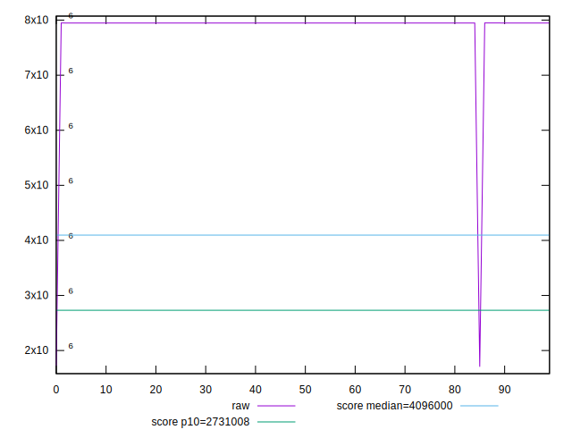
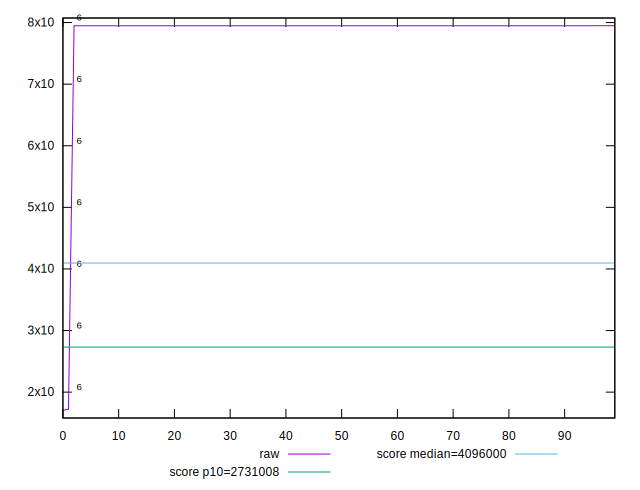
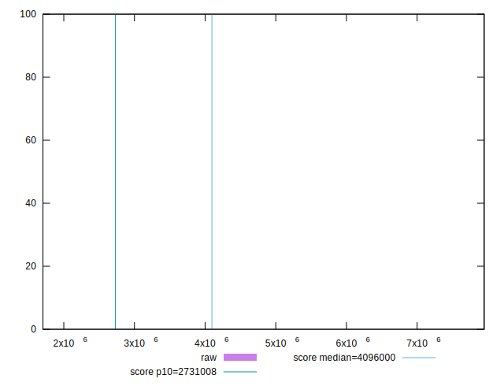
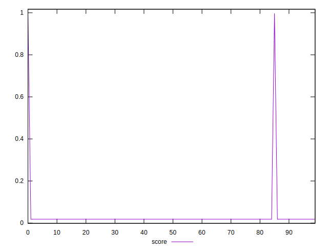

# //total-byte-weight/samples/pages

[→ Parent](../..)


## Raw


```yaml
p90min: 7947933
p90max: 7948029
p90range: 96
p90mean: 7947988.659340659
p90median: 7947988
p90stdev: 27.884069176699892
p90skewness: -0.14252462329136922
p90eccentricity: 0.9999999999999993
p90discretization: 3.033333333333333
outlandishness: 0.9688769636094733

```


## Score


```yaml
p90min: 0.0180449262864667
p90max: 0.01804662047793304
p90range: 0.000001694191466339312
p90mean: 0.018045638199046945
p90median: 0.018045649828312194
p90stdev: 4.92090572021414e-7
p90skewness: 0.14254976022447216
p90eccentricity: 1.0000000000000002
p90discretization: 3.033333333333333
outlandishness: 4.347308270823146

```

