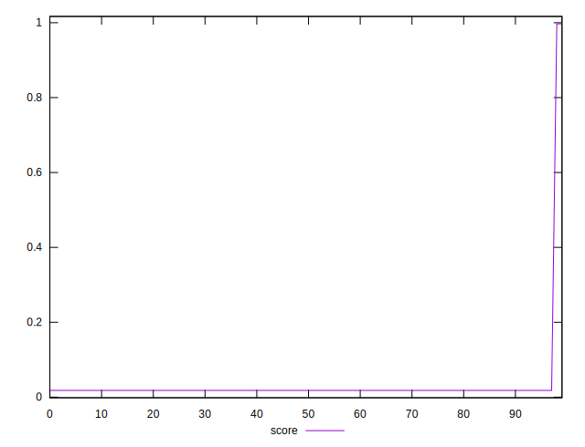
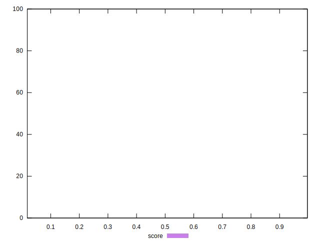

# //total-byte-weight/samples/pages

[→ Parent](../..)


## Raw


```yaml
p90min: 1704956
p90max: 7948024
p90range: 6243068
p90mean: 7809445.944444444
p90median: 7947988
p90stdev: 918980.9453070209
p90skewness: -6.4825140084354365
p90eccentricity: 0.9999999999999988
p90discretization: 2.903225806451613
outlandishness: 1.003558425140915

```


## Score


```yaml
p90min: 0.01803139600571907
p90max: 0.018046285156817832
p90range: 0.000014889151098762543
p90mean: 0.01804504172427016
p90median: 0.01804554394236163
p90stdev: 0.0000022978696270030723
p90skewness: -4.511798011258163
p90eccentricity: 1.0000000000000002
p90discretization: 3
outlandishness: 4.3475956741582635

```

