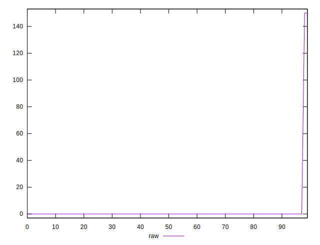
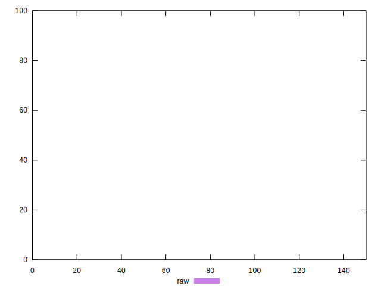
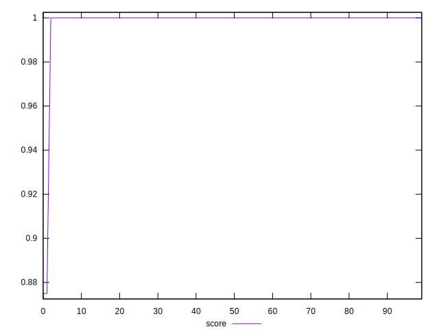
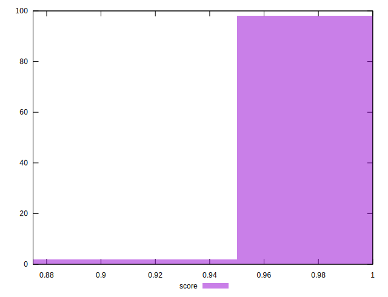

# //unminified-css/samples/pages+cached+nointeractive

[→ Parent](../..)


## Raw


```yaml
p90min: 0
p90max: 0
p90range: 0
p90mean: 0
p90median: 0
p90stdev: 0
p90skewness: .nan
p90eccentricity: .nan
p90discretization: 90
outlandishness: .inf

```


## Score


```yaml
p90min: 0.875
p90max: 1
p90range: 0.125
p90mean: 0.9972222222222222
p90median: 1
p90stdev: 0.01842569327975222
p90skewness: -6.482493908421968
p90eccentricity: 0.999999999999994
p90discretization: 45
outlandishness: 1.0005571806550229

```

