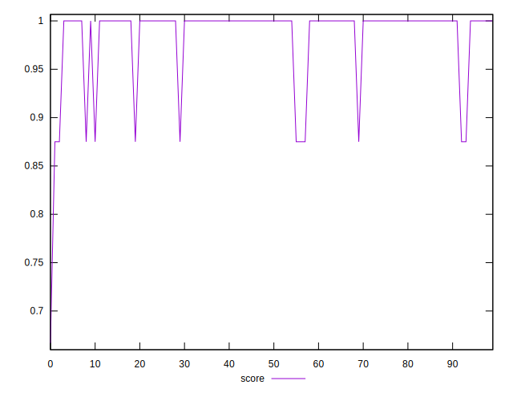

# //unminified-css/samples/pages+cached

[→ Parent](../..)


## Raw


```yaml
p90min: 0
p90max: 150
p90range: 150
p90mean: 5
p90median: 0
p90stdev: 26.92582403567252
p90skewness: 5.199469468957452
p90eccentricity: 0.9999999999999999
p90discretization: 45
outlandishness: 20.25

```


## Score


```yaml
p90min: 0.6666666666666666
p90max: 1
p90range: 0.33333333333333337
p90mean: 0.9796296296296295
p90median: 1
p90stdev: 0.05387902417028206
p90skewness: -3.1077943282683735
p90eccentricity: 1.0000000000000002
p90discretization: 30
outlandishness: 1.0041631140540521

```

