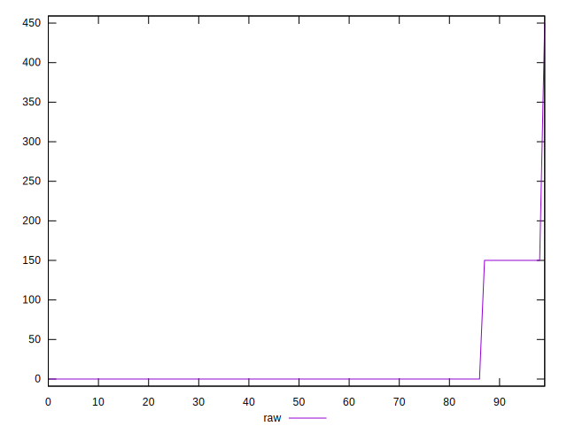
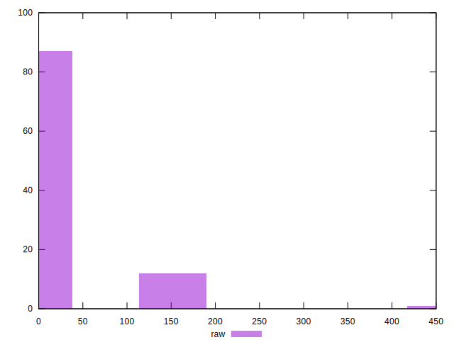

# //unminified-css/samples/pages+cached

[→ Parent](../..)


## Raw


```yaml
p90min: 0
p90max: 150
p90range: 150
p90mean: 6.593406593406593
p90median: 0
p90stdev: 30.74960127391917
p90skewness: 4.44926701957685
p90eccentricity: 1.000000000000005
p90discretization: 45.5
outlandishness: 11.645156250000001

```


## Score


```yaml
p90min: 0.875
p90max: 1
p90range: 0.125
p90mean: 0.9945054945054945
p90median: 1
p90stdev: 0.025624667728265972
p90skewness: -4.449267019576853
p90eccentricity: 1.0000000000000056
p90discretization: 45.5
outlandishness: 0.9743471407398361

```

