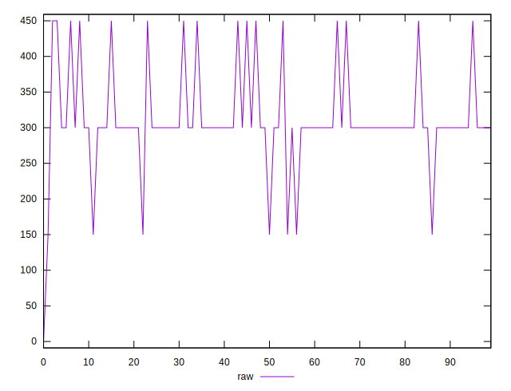
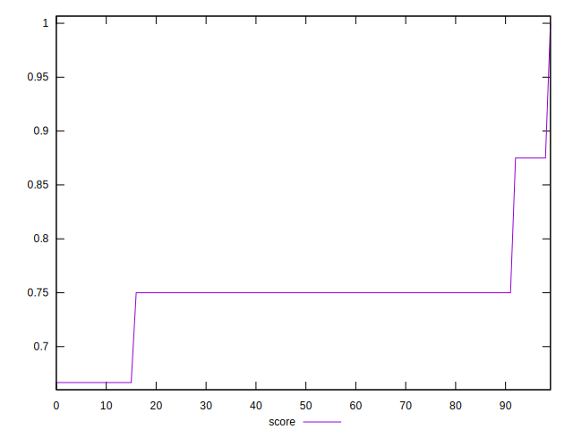

# //unminified-css/samples/pages

[→ Parent](../..)


## Raw


```yaml
p90min: 0
p90max: 450
p90range: 450
p90mean: 295
p90median: 300
p90stdev: 65
p90skewness: -0.9977241693217919
p90eccentricity: 1.0000000000000002
p90discretization: 22.5
outlandishness: 1.1078454467107153

```


## Score


```yaml
p90min: 0.6666666666666666
p90max: 0.75
p90range: 0.08333333333333337
p90mean: 0.735185185185185
p90median: 0.75
p90stdev: 0.031860463952009754
p90skewness: -1.6855907617853734
p90eccentricity: 1.000000000000003
p90discretization: 45
outlandishness: 1.0349346523675682

```

