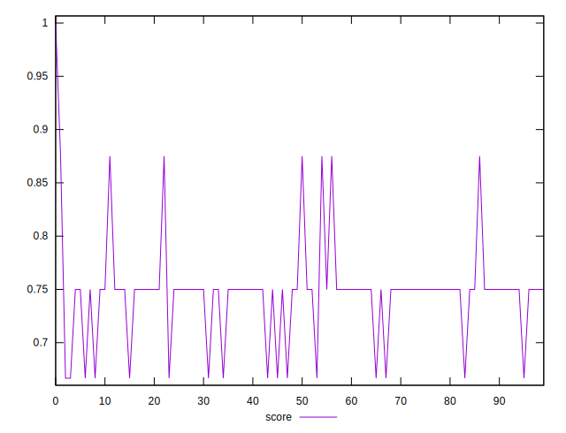

# //unminified-css/samples/pages

[→ Parent](../..)


## Raw


```yaml
p90min: 300
p90max: 450
p90range: 150
p90mean: 324.72527472527474
p90median: 300
p90stdev: 55.65475719604661
p90skewness: 1.806664077165232
p90eccentricity: 0.9999999999999981
p90discretization: 45.5
outlandishness: 0.9143048493906052

```


## Score


```yaml
p90min: 0.6666666666666666
p90max: 0.75
p90range: 0.08333333333333337
p90mean: 0.7362637362637363
p90median: 0.75
p90stdev: 0.030919309553359215
p90skewness: -1.806664077165242
p90eccentricity: 1.0000000000000007
p90discretization: 45.5
outlandishness: 1.0319047264068337

```


## P Score


```yaml
p90min: 0.6666666666666666
p90max: 0.75
p90range: 0.08333333333333337
p90mean: 0.7362637362637363
p90median: 0.75
p90stdev: 0.030919309553359215
p90skewness: -1.806664077165242
p90eccentricity: 1.0000000000000007
p90discretization: 45.5
outlandishness: 1.0319047264068337

```


## Score Difference


```yaml
p90min: 0
p90max: 0.0033333333333334103
p90range: 0.0033333333333334103
p90mean: 0.0005128205128205246
p90median: 0
p90stdev: 0.001202670707647062
p90skewness: 1.9188064472004862
p90eccentricity: 0.9999999999999993
p90discretization: 45.5
outlandishness: 2.9670062499999483

```


## P Score Difference


```yaml
p90min: 0
p90max: 0
p90range: 0
p90mean: 0
p90median: 0
p90stdev: 0
p90skewness: .nan
p90eccentricity: .nan
p90discretization: 91
outlandishness: .nan

```

