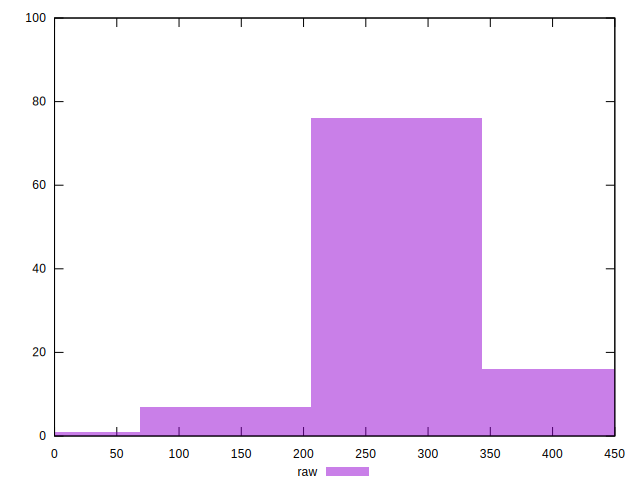

# //unminified-css/samples/pages

[→ Parent](../..)


## Raw


```yaml
p90min: 300
p90max: 450
p90range: 150
p90mean: 324.72527472527474
p90median: 300
p90stdev: 55.65475719604662
p90skewness: 1.8066640771652318
p90eccentricity: 0.999999999999998
p90discretization: 45.5
outlandishness: 0.9143048493906052

```


## Score


```yaml
p90min: 0.6666666666666666
p90max: 0.75
p90range: 0.08333333333333337
p90mean: 0.7362637362637363
p90median: 0.75
p90stdev: 0.03091930955335922
p90skewness: -1.8066640771652427
p90eccentricity: 1.0000000000000007
p90discretization: 45.5
outlandishness: 1.0319047264068337

```

