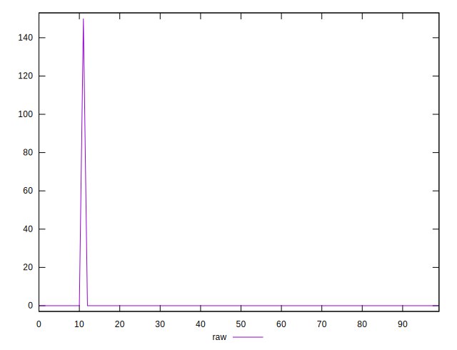
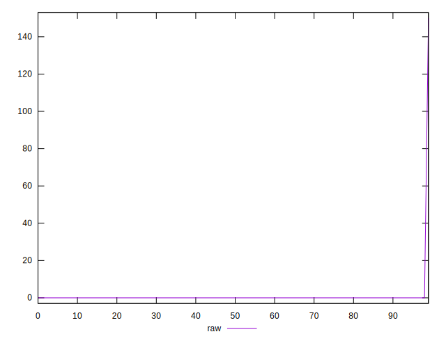
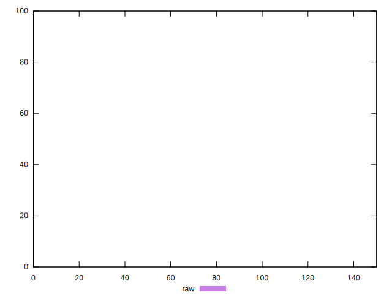
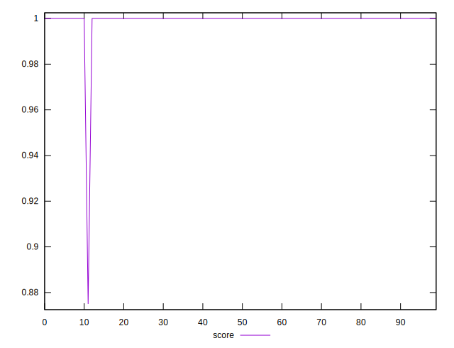
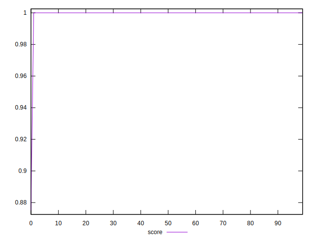
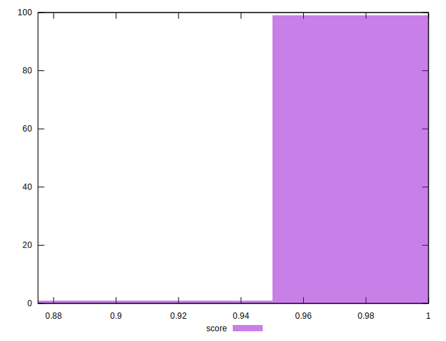

# //unminified-javascript/samples/pages+cached+noexternal+nosvg

[→ Parent](../..)


## Raw


```yaml
p90min: 0
p90max: 0
p90range: 0
p90mean: 0
p90median: 0
p90stdev: 0
p90skewness: .nan
p90eccentricity: .nan
p90discretization: 90
outlandishness: .inf

```


## Score


```yaml
p90min: 0.875
p90max: 1
p90range: 0.125
p90mean: 0.9986111111111111
p90median: 1
p90stdev: 0.013102751572300838
p90skewness: -9.32798134405592
p90eccentricity: 0.9999999999999996
p90discretization: 45
outlandishness: 1.0002781834606478

```

