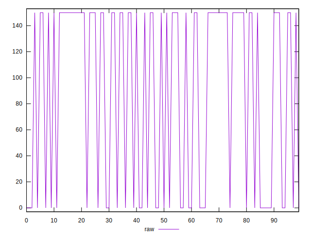
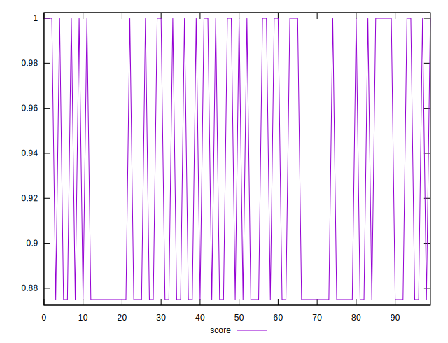

# //unminified-javascript/samples/pages

[→ Parent](../..)


## Raw


```yaml
p90min: 0
p90max: 150
p90range: 150
p90mean: 98.9010989010989
p90median: 150
p90stdev: 71.08964391048737
p90skewness: -0.6724213988522424
p90eccentricity: 0.9999999999999996
p90discretization: 45.5
outlandishness: 0.8280999999999998

```


## Score


```yaml
p90min: 0.875
p90max: 1
p90range: 0.125
p90mean: 0.9175824175824175
p90median: 0.875
p90stdev: 0.05924136992540611
p90skewness: 0.672421398852245
p90eccentricity: 1.0000000000000002
p90discretization: 45.5
outlandishness: 1.0162330130158845

```

