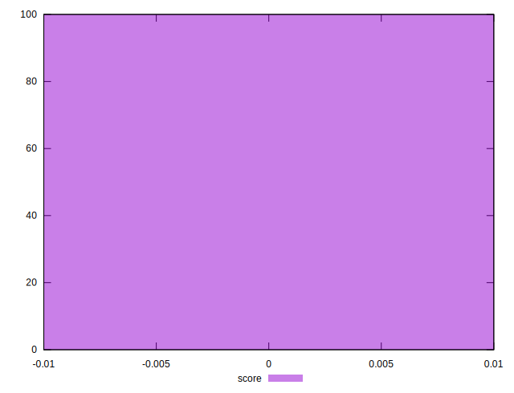

# //unsized-images/samples/pages+cached+noexternal+noimg

[→ Parent](../..)


## Raw


```yaml
p90min: null
p90max: null
p90range: 0
p90mean: null
p90median: null
p90stdev: null
p90skewness: null
p90eccentricity: null
p90discretization: null
outlandishness: null

```


## Score


```yaml
p90min: 0
p90max: 0
p90range: 0
p90mean: 0
p90median: 0
p90stdev: 0
p90skewness: .nan
p90eccentricity: .nan
p90discretization: 91
outlandishness: .nan

```

