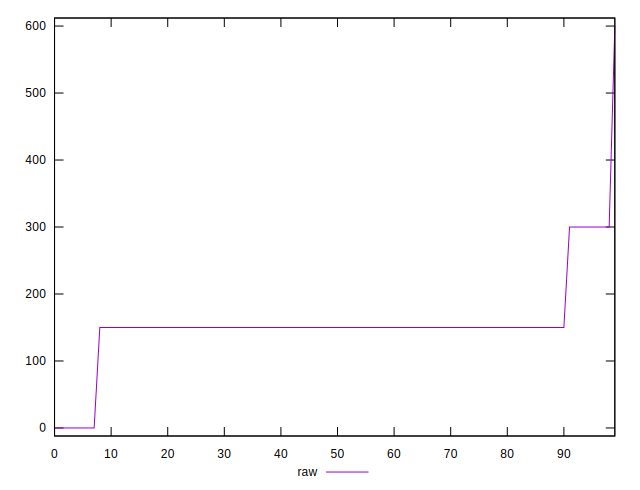
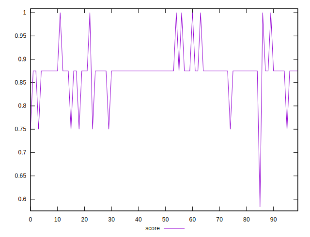

# //unused-css-rules/samples/pages

[→ Parent](../..)


## Raw


```yaml
p90min: 0
p90max: 150
p90range: 150
p90mean: 136.66666666666666
p90median: 150
p90stdev: 42.68749491621899
p90skewness: -2.8892145949392356
p90eccentricity: 0.9999999999999969
p90discretization: 45
outlandishness: 1.2780026769779895

```


## Score


```yaml
p90min: 0.5833333333333334
p90max: 0.875
p90range: 0.29166666666666663
p90mean: 0.8606481481481483
p90median: 0.875
p90stdev: 0.04613165167966676
p90skewness: -3.613123381391193
p90eccentricity: 1.0000000000000047
p90discretization: 30
outlandishness: 1.0267499633233896

```

