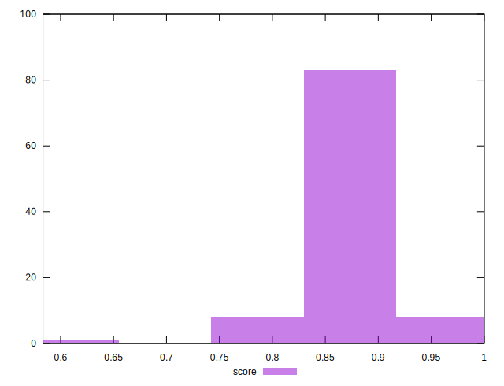

# //unused-css-rules/samples/pages

[→ Parent](../..)


## Raw


```yaml
p90min: 150
p90max: 300
p90range: 150
p90mean: 163.1868131868132
p90median: 150
p90stdev: 42.47505074744548
p90skewness: 2.9105644713987404
p90eccentricity: 1.0000000000000002
p90discretization: 45.5
outlandishness: 0.896369033772064

```


## Score


```yaml
p90min: 0.75
p90max: 0.875
p90range: 0.125
p90mean: 0.864010989010989
p90median: 0.875
p90stdev: 0.03539587562287121
p90skewness: -2.910564471398749
p90eccentricity: 1.0000000000000018
p90discretization: 45.5
outlandishness: 1.0187730338306136

```


## P Score


```yaml
p90min: 0.75
p90max: 0.875
p90range: 0.125
p90mean: 0.864010989010989
p90median: 0.875
p90stdev: 0.03539587562287121
p90skewness: -2.910564471398749
p90eccentricity: 1.0000000000000018
p90discretization: 45.5
outlandishness: 1.0187730338306136

```


## Score Difference


```yaml
p90min: 0
p90max: 0.0050000000000000044
p90range: 0.0050000000000000044
p90mean: 0.004560439560439565
p90median: 0.0050000000000000044
p90stdev: 0.0014158350249148508
p90skewness: -2.9105644713987444
p90eccentricity: 0.9999999999999997
p90discretization: 45.5
outlandishness: 0.8148506136997786

```


## P Score Difference


```yaml
p90min: 0
p90max: 0
p90range: 0
p90mean: 0
p90median: 0
p90stdev: 0
p90skewness: .nan
p90eccentricity: .nan
p90discretization: 91
outlandishness: .nan

```

