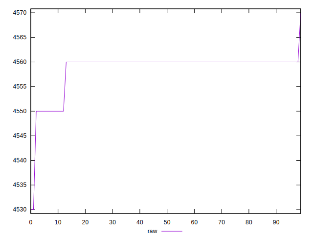
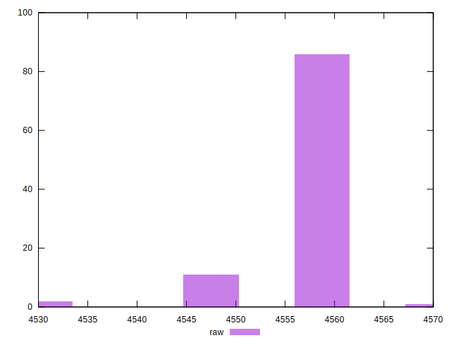
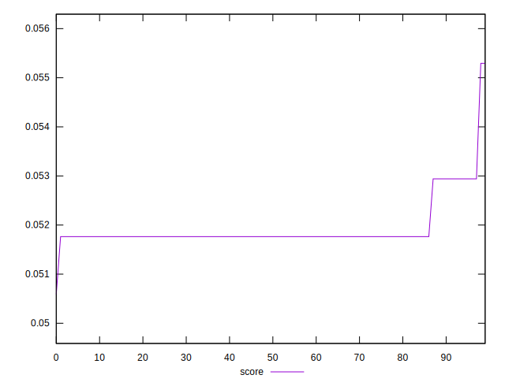

# //unused-javascript/samples/pages+cached+nointeractive

[→ Parent](../..)


## Raw


```yaml
p90min: 4550
p90max: 4560
p90range: 10
p90mean: 4559.450549450549
p90median: 4560
p90stdev: 2.2787298190470078
p90skewness: -3.90616685958006
p90eccentricity: 0.9999999999999949
p90discretization: 45.5
outlandishness: 0.9995392302603727

```


## Score


```yaml
p90min: 0.051764705882352935
p90max: 0.052941176470588214
p90range: 0.0011764705882352788
p90mean: 0.05182934712346476
p90median: 0.051764705882352935
p90stdev: 0.0002680858610643495
p90skewness: 3.906166859580341
p90eccentricity: 1.0000000000000018
p90discretization: 45.5
outlandishness: 1.004774955626468

```


## P Score


```yaml
p90min: 0.051764705882352935
p90max: 0.052941176470588214
p90range: 0.0011764705882352788
p90mean: 0.05182934712346476
p90median: 0.051764705882352935
p90stdev: 0.0002680858610643495
p90skewness: 3.906166859580341
p90eccentricity: 1.0000000000000018
p90discretization: 45.5
outlandishness: 1.004774955626468

```


## Score Difference


```yaml
p90min: -0.002941176470588211
p90max: -0.0005882352941176533
p90range: 0.0023529411764705577
p90mean: -0.001803490627020032
p90median: -0.0017647058823529321
p90stdev: 0.00027302795193203034
p90skewness: -2.208527462489553
p90eccentricity: 1.0000000000000049
p90discretization: 30.333333333333332
outlandishness: 0.9447282588867048

```


## P Score Difference


```yaml
p90min: 0
p90max: 0
p90range: 0
p90mean: 0
p90median: 0
p90stdev: 0
p90skewness: .nan
p90eccentricity: .nan
p90discretization: 91
outlandishness: .nan

```

