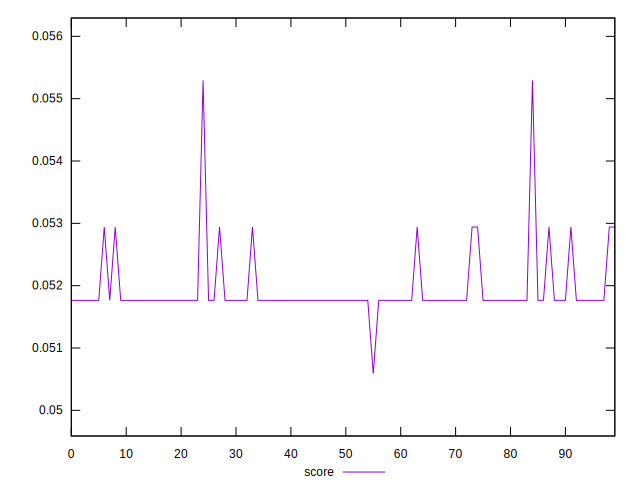

# //unused-javascript/samples/pages+cached+nointeractive

[→ Parent](../..)


## Raw


```yaml
p90min: 4530
p90max: 4560
p90range: 30
p90mean: 4558.111111111111
p90median: 4560
p90stdev: 5.352973097975957
p90skewness: -3.6059943865402135
p90eccentricity: 1.000000000000005
p90discretization: 30
outlandishness: 1.000126762176964

```


## Score


```yaml
p90min: 0.050588235294117656
p90max: 0.052941176470588214
p90range: 0.0023529411764705577
p90mean: 0.051790849673202605
p90median: 0.051764705882352935
p90stdev: 0.00024664002959624804
p90skewness: 2.092602556372058
p90eccentricity: 0.9999999999999971
p90discretization: 30
outlandishness: 1.0062692601419692

```

