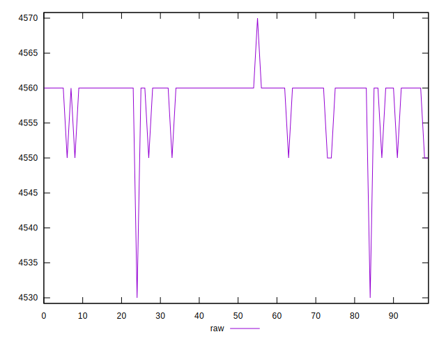

# //unused-javascript/samples/pages+cached+nointeractive

[→ Parent](../..)


## Raw


```yaml
p90min: 4550
p90max: 4560
p90range: 10
p90mean: 4559.450549450549
p90median: 4560
p90stdev: 2.2787298190470042
p90skewness: -3.9061668595800723
p90eccentricity: 1.0000000000000013
p90discretization: 45.5
outlandishness: 0.9995392302603727

```


## Score


```yaml
p90min: 0.051764705882352935
p90max: 0.052941176470588214
p90range: 0.0011764705882352788
p90mean: 0.051829347123464764
p90median: 0.051764705882352935
p90stdev: 0.00026808586106434964
p90skewness: 3.906166859580424
p90eccentricity: 1.0000000000000002
p90discretization: 45.5
outlandishness: 1.0047749556264676

```

