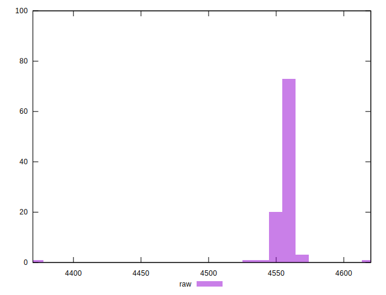
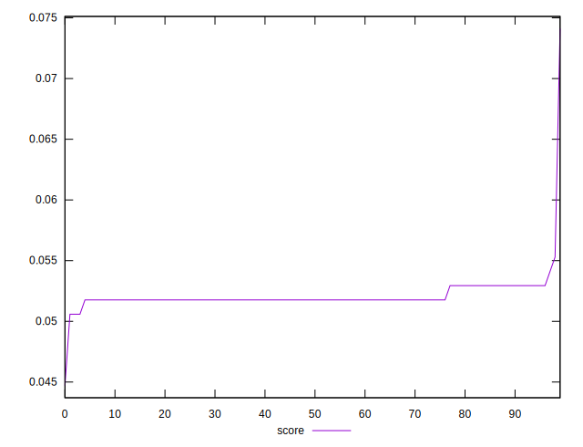

# //unused-javascript/samples/pages+cached

[→ Parent](../..)


## Raw


```yaml
p90min: 4370
p90max: 4560
p90range: 190
p90mean: 4555.111111111111
p90median: 4560
p90stdev: 20.343955938063683
p90skewness: -8.389089960245474
p90eccentricity: 1.0000000000000033
p90discretization: 18
outlandishness: 1.0006099085605291

```


## Score


```yaml
p90min: 0.04470588235294115
p90max: 0.052941176470588214
p90range: 0.008235294117647063
p90mean: 0.051816993464052254
p90median: 0.051764705882352935
p90stdev: 0.0008927252851745803
p90skewness: -5.4145033582022535
p90eccentricity: 1.0000000000000036
p90discretization: 22.5
outlandishness: 1.0139230018959744

```

