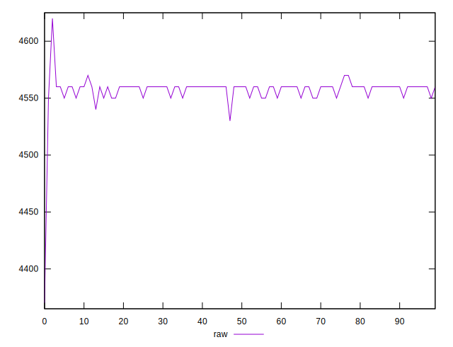
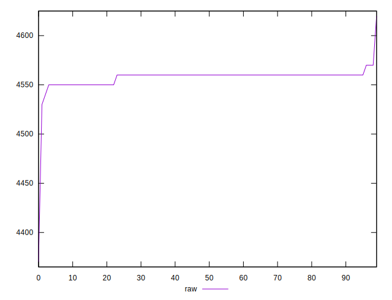

# //unused-javascript/samples/pages+cached

[→ Parent](../..)


## Raw


```yaml
p90min: 4550
p90max: 4560
p90range: 10
p90mean: 4558.021978021978
p90median: 4560
p90stdev: 3.983421749536676
p90skewness: -1.5172774624374277
p90eccentricity: 0.9999999999999977
p90discretization: 45.5
outlandishness: 0.9993322875905435

```


## Score


```yaml
p90min: 0.051764705882352935
p90max: 0.052941176470588214
p90range: 0.0011764705882352788
p90mean: 0.05199741435035551
p90median: 0.051764705882352935
p90stdev: 0.00046863785288666087
p90skewness: 1.517277462437744
p90eccentricity: 1.0000000000000018
p90discretization: 45.5
outlandishness: 1.0068989789437555

```

