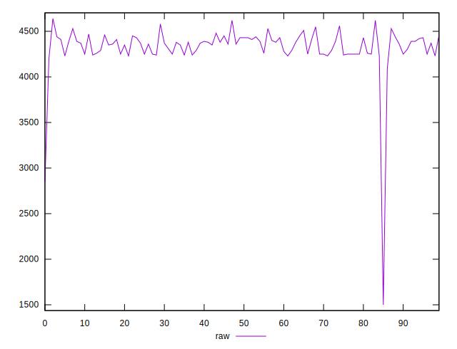
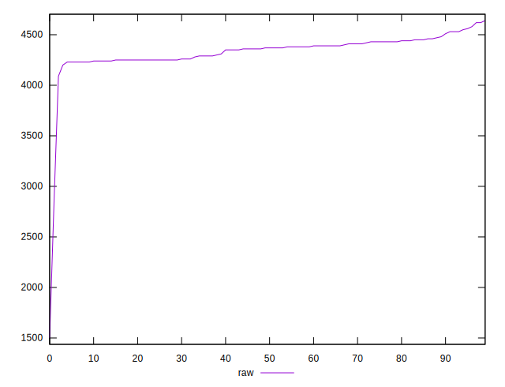
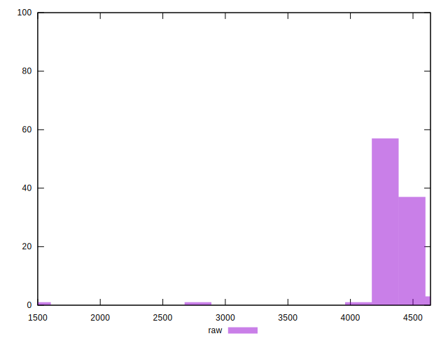
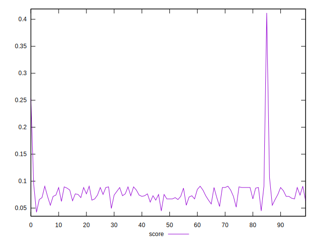
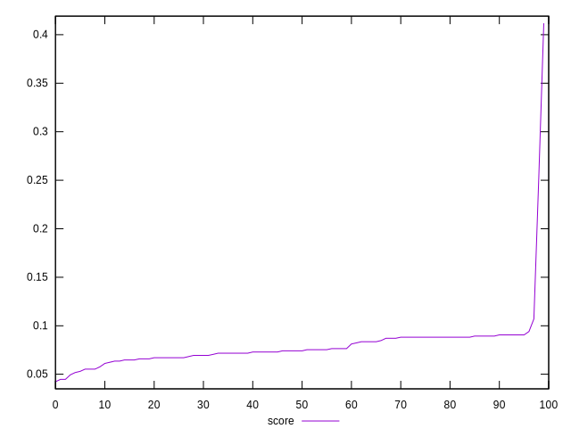
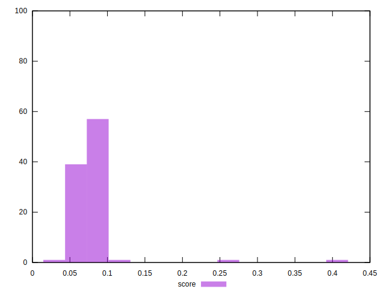

# //unused-javascript/samples/pages

[→ Parent](../..)


## Raw


```yaml
p90min: 4200
p90max: 4530
p90range: 330
p90mean: 4346.483516483517
p90median: 4360
p90stdev: 86.71506487079645
p90skewness: 0.12098165048826326
p90eccentricity: 1.0000000000000002
p90discretization: 3.64
outlandishness: 0.985748308594466

```


## Score


```yaml
p90min: 0.05529411764705883
p90max: 0.09411764705882353
p90range: 0.0388235294117647
p90mean: 0.07688429217840981
p90median: 0.07529411764705879
p90stdev: 0.010201772337740753
p90skewness: -0.12098165048826698
p90eccentricity: 1.0000000000000002
p90discretization: 3.64
outlandishness: 1.0973892391479263

```

