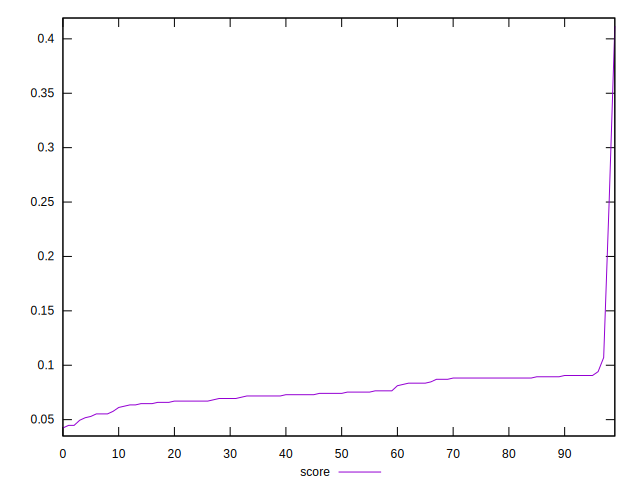

# //unused-javascript/samples/pages

[→ Parent](../..)


## Raw


```yaml
p90min: 1500
p90max: 4480
p90range: 2980
p90mean: 4287.444444444444
p90median: 4360
p90stdev: 344.00439632562546
p90skewness: -6.698620371732422
p90eccentricity: 0.999999999999999
p90discretization: 3.4615384615384617
outlandishness: 1.0130831760748287

```


## Score


```yaml
p90min: 0.04235294117647059
p90max: 0.08941176470588236
p90range: 0.047058823529411764
p90mean: 0.07383006535947709
p90median: 0.07294117647058823
p90stdev: 0.011752033843444868
p90skewness: -0.5060211119227489
p90eccentricity: 1.0000000000000002
p90discretization: 3.2142857142857144
outlandishness: 1.1900615738530136

```

